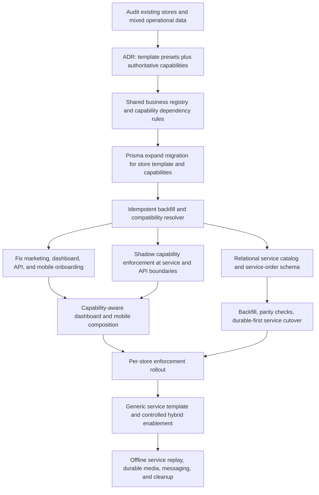

# Plan: Business Template Capability Gating And Service Architecture

## Type
Feature

## Status
Proposed

## Created Date
2026-07-17

## Last Updated
2026-07-17

## Goal Or Problem
Make a store's operating model authoritative across onboarding, APIs, dashboard, mobile, reports, public links, and offline behavior. Dry Cleaning / Laundry must operate as a no-retail-stock service business by default, Product Sales must retain its inventory workflow, generic service businesses must have a reusable service foundation, and explicitly enabled hybrid businesses must be possible without scattering template-name conditionals through the codebase.

## Current Context
- The repository defines `product_sales`, `dry_cleaning_laundry`, and `other_generic` templates in `packages/db/src/queries/business-templates.ts`.
- Dry Cleaning / Laundry already has a working metadata-backed catalog, service-order lifecycle, public request links, customer tracking, operational reports, dashboard workspace, and mobile workflow.
- Dry-cleaning commands correctly assert the selected store template and do not create or deduct Product Sales inventory.
- Product, inventory, sales, share-link, session, closeout, report, dashboard, and mobile workflows are not consistently restricted by store template.
- Dashboard navigation only uses the template to add `/services`; it does not remove Product Sales surfaces for dry-cleaning stores.
- Mobile keeps a local free-text business `type` and exposes product sales, stock, and services together without a canonical capability set.
- Marketing and mobile owner signup can create a first store without a template selection, which resolves to Product Sales and can bypass dashboard first-store setup.
- `other_generic` is demand capture only, not an operational generic service-business template.
- Dry-cleaning operational data is stored by rewriting bounded arrays under `Store.metadata.retailOps.dryCleaning`; dedicated relational tables, offline service replay, durable media, and provider-native messaging are deferred.
- Store template changes are audited and blocked by default once product, order, or dry-cleaning operational data exists.
- The current worktree contains unrelated/uncommitted onboarding, auth, currency, mobile form, and package changes. Implementation must preserve or first land those changes without overwriting them.

## Proposed Approach
Use a two-layer operating model:

1. A **business template** is an onboarding preset and classification, such as Product Sales, Dry Cleaning / Laundry, Generic Service Business, or Other / Unsupported.
2. **Store capabilities** are the authoritative runtime permissions for workflows. Roles answer who may perform an action; capabilities answer whether the selected store supports that action; subscription entitlements answer whether the tenant's plan permits the action.

Recommended access formula:

`allowed = tenant/store scope valid AND role allows operation AND store capability enabled AND subscription entitlement satisfied`

Recommended initial capability keys:

| Capability | Purpose | Dependency |
| --- | --- | --- |
| `product_catalog` | Create and manage products and sellable variants | none |
| `inventory` | Stock balances, intake, adjustments, conversions, wallets | `product_catalog` |
| `product_sales` | POS sales, product orders, receipts | `product_catalog` |
| `product_share_links` | Public product links and product order requests | `product_catalog`, `product_sales` |
| `cashier_sessions` | Product-sales clock-in, opening inventory, and closeout | `product_sales` |
| `retail_reports` | Product, stock, sales, rep, and closeout reports | relevant retail capability |
| `offline_retail_ops` | Product-sales offline queue and replay | relevant retail capability |
| `service_catalog` | Create and manage services and service variants | none |
| `service_orders` | Intake, pricing snapshots, payment state, due work, status lifecycle | `service_catalog` |
| `service_request_links` | Public service requests and conversion | `service_orders` |
| `service_tracking` | Accountless customer tracking | `service_orders` |
| `service_reports` | Service order, payment, completion, and conversion reports | `service_orders` |
| `delivery_requests` | Create fulfillment handoffs from supported order sources | a compatible order capability |
| `demand_capture` | Record unsupported business requirements | none |

Shared surfaces such as tenant settings, subscription, staff administration, and the customer identity foundation remain role/entitlement controlled unless a future product decision makes them capability-specific.

Recommended template defaults:

| Template | Default enabled capabilities |
| --- | --- |
| `product_sales` | product catalog, inventory, product sales, product share links, cashier sessions, retail reports, offline retail ops |
| `dry_cleaning_laundry` | service catalog, service orders, service request links, service tracking, service reports |
| `service_business` | service catalog, service orders, service request links, service tracking, service reports |
| `other_generic` | demand capture only, followed by a supported-template selection or product-support handoff |

Do not expose a separate `hybrid` template initially. The capability model must support hybrid stores by explicitly enabling both product and service capabilities, but product UI for enabling hybrid mode should remain feature-gated until its onboarding and billing implications are approved.

Adopt an expand/backfill/contract rollout:

1. Add durable nullable template and capability storage while retaining metadata fallback.
2. Backfill existing stores idempotently.
3. Run capability checks in shadow mode and record would-be denials.
4. Fix onboarding and clients so canonical capabilities are always available.
5. Enforce capabilities at service/API boundaries and reflect them in UI.
6. Move dry-cleaning operations from metadata to relational service tables using durable-first reads and a controlled cutover.
7. Remove legacy metadata authority only after parity and rollback evidence exist.

## Visual Plan

## Implementation Steps

### Phase 0: Establish Baseline And Protect Existing Work
1. Record the current branch, dirty files, current migrations, deployed database profiles, and current business-template fixtures.
2. Resolve the current `@ewatrade/utils` workspace-resolution failure so existing store-onboarding tests execute before architecture work begins.
3. Run and preserve baseline results for:
   - `packages/db/src/queries/business-templates.test.ts`
   - `packages/db/src/queries/stores.test.ts`
   - `apps/dashboard/src/lib/navigation.test.ts`
   - mobile service-order structural checks
   - marketing onboarding E2E when its local dependencies are available
4. Add a read-only audit script that reports, per active store:
   - effective metadata template
   - product count
   - commerce order count
   - dry-cleaning service item/order/request counts
   - whether the store contains mixed product and service data
   - whether it lacks explicit template metadata
5. Export only aggregate counts in logs. Do not print customer names, contact details, tokens, evidence URLs, or order notes.
6. Decision gate: approve the mixed-data remediation report before enforcement. Recommended default is to preserve observed legacy capabilities for mixed stores and mark them for owner review instead of disabling active workflows.

Validation:
- Baseline tests are green or every pre-existing failure has an owner and written explanation.
- Audit script is read-only, tenant-safe, and idempotent.
- No current uncommitted user changes are overwritten.

### Phase 1: Record The Durable Architecture Decision
1. Add an ADR under `.brain/decisions/` documenting:
   - templates are presets, not authorization checks
   - capabilities are the runtime source of truth
   - role, capability, and subscription checks are separate
   - hybrid operation is represented by capability composition
   - capability checks belong at service/API boundaries
   - clients consume canonical server capabilities and never infer authority from labels
   - legacy metadata remains a temporary compatibility source
2. Update the business-type feature record with the target state and migration stages.
3. Define stable error semantics:
   - code: `CAPABILITY_NOT_ENABLED`
   - HTTP/tRPC mapping: forbidden
   - safe metadata: capability key and selected store id only for authenticated calls
   - public endpoints return a generic unavailable/not-found response
4. Define capability dependency and incompatibility rules. Examples:
   - `inventory` requires `product_catalog`
   - `service_request_links` requires `service_orders`
   - `offline_retail_ops` cannot remain enabled if all retail mutation capabilities are disabled
5. Decision gate: approve the initial capability list and template defaults before adding schema.

Validation:
- ADR, feature documentation, API permission documentation, and implementation terminology agree.
- No UI-specific route names leak into the domain capability registry.

### Phase 2: Create A Shared Business Registry
1. Add a pure workspace package such as `packages/business/` with no database, React, or server-only dependency.
2. Move canonical definitions into the package:
   - `BusinessTemplateKey`
   - `BusinessCapabilityKey`
   - template labels, descriptions, terminology, and default capability sets
   - dependency validation
   - capability set normalization
   - helper predicates such as `hasCapability` and `assertValidCapabilitySet`
3. Keep app-specific route maps in their respective apps. The shared package should describe business rules, not dashboard or mobile navigation.
4. Replace duplicated template arrays/enums in dashboard and API schemas with imports from the canonical package where runtime bundling is safe.
5. Preserve existing external keys and API procedure names during this phase.
6. Add pure unit tests for:
   - each template's exact default set
   - dependency closure
   - invalid combinations
   - hybrid product-plus-service capability composition
   - stable serialization order

Validation:
- `@ewatrade/business` typechecks independently.
- No package import creates a browser bundle dependency on `@ewatrade/db`.
- Current Product Sales and Dry Cleaning template keys remain backward compatible.

### Phase 3: Add Durable Store Template And Capability Storage
1. Add Prisma source definitions, preferably in `packages/db/prisma/models/business.prisma`, and relations on `Store`.
2. Recommended first expand schema:
   - nullable `Store.businessTemplateKey`
   - `Store.businessTemplateVersion`
   - `StoreCapability`
     - `id`
     - `tenantId`
     - `storeId`
     - `capabilityKey`
     - `enabled`
     - `source` (`TEMPLATE`, `MANUAL`, `MIGRATION`, `SYSTEM`)
     - optional bounded `config`
     - `createdAt`, `updatedAt`
     - unique `(storeId, capabilityKey)`
     - tenant/capability indexes
   - `StoreCapabilityAudit`
     - actor, reason, previous/new state, timestamp
3. Keep `businessTemplateKey` nullable for the expand stage. A non-null default would incorrectly override existing dry-cleaning metadata before backfill.
4. Add repository functions:
   - `resolveStoreBusinessProfile`
   - `listStoreCapabilities`
   - `storeHasCapability`
   - `assertStoreCapability`
   - `applyTemplateDefaults`
   - `updateStoreCapabilities`
5. Resolution order during rollout:
   - durable capability rows when present
   - durable template defaults when template is present
   - legacy metadata template/defaults
   - Product Sales compatibility default only when no explicit classification exists
6. Ensure every query scopes by both tenant and store.
7. Change store creation so the store, template snapshot, capability rows, and onboarding session are committed atomically. Repository functions must accept an existing transaction client when tenant provisioning already owns the transaction.
8. Follow the repository Prisma workflow:
   - update Prisma source schema
   - run `bun db:migrate`
   - run `bun db:push`
   - do not hand-write migration files
9. Update generated types and repository exports.

Validation:
- Prisma format/generate/migrate/push succeed against the intended local profile.
- Store creation cannot leave a store without its template/capability snapshot.
- Capability reads cannot cross tenant boundaries.
- Existing stores still resolve through metadata fallback before backfill.

### Phase 4: Backfill Existing Stores Safely
1. Add an idempotent backfill script under `packages/db/scripts/`.
2. For each store:
   - read explicit legacy template metadata
   - inspect existing product/order/service records
   - write the durable template
   - materialize default capability rows
   - preserve observed mixed behavior as `MIGRATION` capability overrides
   - write a bounded audit record
3. Classification rules:
   - explicit dry-cleaning metadata and no product operations: Dry Cleaning defaults only
   - explicit Product Sales or no metadata and only product operations: Product Sales defaults
   - `other_generic` with no operational records: demand capture only
   - mixed product and dry-cleaning records: preserve both capability families and flag `needsReview`
   - unclassifiable stores: do not guess; leave nullable and include in the exception report
4. Add `--dry-run`, `--store-id`, `--tenant-id`, bounded batch size, resumable cursor, and aggregate summary modes.
5. Hash or omit public tokens and private evidence from logs.
6. Run dry-run locally, then against remote development only when explicitly approved.
7. Decision gate: review exception and mixed-store counts before any capability enforcement.

Validation:
- Re-running the backfill makes no additional changes.
- Backfilled capability sets match expected template defaults plus preserved legacy overrides.
- Every changed store has an audit trail.
- No service, order, product, or inventory data is deleted or silently archived.

### Phase 5: Make All Signup And Store-Creation Paths Canonical
1. Marketing signup:
   - add an explicit business-template question separate from industry
   - include Product Sales, Dry Cleaning / Laundry, Generic Service Business, and Other / Unsupported
   - map template-specific follow-up questions
   - create the first store through the shared store-provisioning boundary
   - pass template and onboarding answers into the same durable capability initialization
   - remove direct unclassified `tx.store.create` behavior
2. Dashboard:
   - fetch template definitions from the canonical API/registry
   - retain the no-store `/setup` route
   - ensure setup writes template and capabilities atomically
   - add an owner/admin business-profile settings surface for safe correction
3. Mobile owner signup:
   - collect template before requesting OTP or Google verification
   - carry the template through OTP verification payloads without trusting client labels
   - create the first store with template defaults
   - include canonical `storeId`, template, and capabilities in the returned session/business context
4. Mobile business switching/creation:
   - replace local-only business creation for authenticated production users with `tenant.createStore`
   - keep local fixtures explicitly development-only
   - persist the server store id, template, capabilities, currency, and version locally
5. `Other / Unsupported` handling:
   - capture description and requested capabilities
   - show a truthful limited-support state
   - do not silently drop the user into Product Sales
6. Correction rules:
   - owner/admin only
   - show impacted capabilities and detected operational data
   - block unsafe changes by default
   - route exceptional mixed-data conversion through an internal/admin-reviewed migration, not a public `allowOperationalDataChange` switch

Validation:
- Marketing, dashboard, tRPC store creation, mobile OTP signup, and mobile Google signup create identical business-profile results for the same input.
- A new dry-cleaning user reaches a service-first home without manual QA scripts.
- A new Product Sales user reaches product setup.
- Other / Unsupported never defaults silently to Product Sales.

### Phase 6: Enforce Capabilities At Server Boundaries
1. Add one shared server helper that resolves tenant/store scope, role, capability, and entitlement in a consistent order.
2. Apply capability checks inside domain/service or repository command boundaries, not only routers.
3. Product capability coverage:
   - product list/create/update/price history
   - inventory reads and all stock mutations
   - sale creation and product order reads
   - product share-link creation, public resolution, and follow-up
   - staff stock wallets
   - cashier sessions, opening inventory, closeout, and retail reconciliation
   - retail reports and retail offline replay events
4. Service capability coverage:
   - service catalog reads/writes
   - service-order reads/writes and transitions
   - request-link creation and public resolution
   - request conversion
   - tracking
   - service reports
5. Public endpoints must resolve the owning store and confirm that the required capability and link are active before returning data.
6. Dashboard REST bridge routes must use the same helpers as tRPC; do not rely on navigation hiding.
7. Offline replay:
   - validate the capability at replay time
   - return a stable non-retryable result for events whose capability is disabled
   - surface queued events that would become invalid before allowing a template/capability change
8. Introduce shadow mode:
   - evaluate every check
   - log aggregate would-deny counters without blocking
   - compare counters with known mixed-store exceptions
9. Roll out enforcement per capability family and store cohort after shadow validation.

Validation:
- Direct API calls cannot use a hidden capability.
- Role denial, capability denial, and subscription denial remain distinguishable in tests and safe user messages.
- Public endpoints do not reveal whether another tenant has a disabled service.
- Existing mixed stores retain only the migration-preserved capabilities.

### Phase 7: Make Dashboard Composition Capability-Aware
1. Change dashboard tenant context from `storeBusinessTemplateKey` to a canonical business profile containing template, effective capabilities, and version.
2. Map every navigation item and known route to required capabilities.
3. Enforce the same route rule in the shell and page/server loader.
4. Recommended default composition:
   - Product Sales: Products, Inventory, Sales, product Customers, Generated Product Links, Retail Reports
   - Dry Cleaning / Service Business: Service Catalog/Orders, service Customers, Service Request Links, Service Reports
   - Shared: Overview, Staff, Settings, Subscription
5. Split the current overview into capability-owned sections. Do not render low-stock, product metrics, closeout, or first-product prompts for service-only stores.
6. Make command search capability-aware for both page commands and record groups.
7. Replace product-specific labels with capability-specific language where a surface is shared.
8. Add loading, empty, unsupported, and capability-changed states using the project's Midday dashboard patterns.

Validation:
- Navigation visibility and direct URL access produce the same result.
- A dry-cleaning store cannot reach `/products`, `/inventory`, product `/sales`, or product links unless the matching capability is explicitly enabled.
- A Product Sales store cannot reach `/services` unless service capabilities are explicitly enabled.
- Hybrid fixtures show both families without duplicating shared navigation.

### Phase 8: Make Mobile Canonically Capability-Aware
1. Extend the authenticated profile/tenant response and `RetailOpsBusiness` record with:
   - server store id
   - template key
   - effective capabilities
   - business-profile version
   - currency
2. Treat local state as a cache, never as authorization.
3. Replace unconditional home actions with capability-derived composition:
   - service-only center action: new service order
   - retail-only center action: new sale
   - hybrid center action: explicit action chooser
4. Hide or replace retail-only elements for service stores:
   - Stocks tab
   - first-product prompt
   - stock metrics and alerts
   - product sale and closeout flows
   - retail reports
5. Hide service entries for stores without service capabilities.
6. Add route guards to every workflow modal. Route guards should refetch the business profile if the cached version is stale.
7. Scope local persisted products, sales, service drafts, and sync events by the canonical server store id.
8. On business switch, invalidate queries and recompute navigation before rendering the next home.
9. Add a safe stale-capability response:
   - refresh profile on `CAPABILITY_NOT_ENABLED`
   - close the unavailable workflow
   - preserve unsent form data only when it can be safely resumed

Validation:
- Owner and attendant homes match the selected store's capabilities.
- Deep links cannot open an unsupported workflow.
- Switching between Product Sales and Dry Cleaning stores changes tabs/actions without app restart.
- Development fixtures are clearly separated from production business records.

### Phase 9: Introduce A Durable Generic Service Domain
1. Add dedicated Prisma source models in a new service-domain schema file:
   - `ServiceSettings`
   - `ServiceItem`
   - `ServiceItemVariant`
   - `ServiceOrder`
   - `ServiceOrderLine`
   - `ServiceOrderEvent`
   - `ServiceOrderEvidence`
   - `ServiceRequestLink`
   - `ServiceRequest`
   - `ServiceRequestLine`
   - `ServiceNotificationIntent`
2. Every tenant-owned row must carry or derive tenant/store scope, have appropriate indexes, and use explicit delete behavior.
3. Keep commerce `Order` and `OrderItem` unchanged in this migration. Product order lines currently require products, so forcing service lines into that model would weaken invariants.
4. Use service-specific enums for:
   - item status
   - order status
   - payment state including partial/pay-on-collection/pay-on-delivery
   - request status
   - evidence type/visibility
   - notification intent status/channel
5. Preserve immutable snapshots on service-order/request lines:
   - service name
   - variant name
   - unit price
   - quantity
   - surcharge and total
6. Store opaque public tokens as hashes where practical. Return raw tokens only at creation and compare hashes on public resolution.
7. Keep dry-cleaning-specific terminology and intake behavior in a vertical adapter/profile rather than forking the core service-order lifecycle.
8. Reuse the existing customer identity foundation where possible while preserving order-time contact snapshots.
9. Add fulfillment source-adapter work as a linked follow-up. Do not weaken the current `DeliveryRequest.orderId` invariant inside the service migration without a separate accepted ADR.
10. Run required Prisma migration and push commands after schema changes. Do not manually create migration files.

Validation:
- Generic service orders can exist without products or inventory rows.
- Dry-cleaning behavior is expressible through the generic service domain plus dry-cleaning configuration.
- Historical order totals do not change after catalog edits.
- Public tokens, private evidence, and tenant scoping pass security-focused tests.

### Phase 10: Migrate Metadata-Backed Dry Cleaning Data
1. Put current metadata access behind a repository interface before changing storage.
2. Add an idempotent metadata-to-relational migration:
   - preserve legacy ids where valid
   - preserve timestamps, status history, customer snapshots, price snapshots, tracking, request conversion links, and notification intents
   - hash public tokens during import while retaining a controlled compatibility lookup period
3. Add durable-first reads with metadata fallback.
4. Add shadow parity comparison for aggregate counts and selected normalized records.
5. Switch writes to relational transactions. If rollback metadata mirroring is required, make it explicitly temporary and observable.
6. Cut over per store only after:
   - item/order/request counts match
   - totals match
   - status histories match
   - public request and tracking links resolve
7. Mark migrated stores with a storage version.
8. Retain metadata read fallback for one release window, then remove it after production evidence and rollback approval.

Validation:
- Migration is restartable and does not duplicate rows.
- Aggregate order totals and report outputs match before and after cutover.
- Concurrent service-order creation no longer rewrites a shared Store metadata document.
- Rollback procedure is tested before the first production cohort.

### Phase 11: Deliver Generic Service And Controlled Hybrid UX
1. Add `service_business` onboarding and neutral service terminology:
   - Service
   - Service option
   - Service order
   - Due work
   - Request service
2. Keep dry-cleaning-specific fields conditional:
   - garment/item evidence
   - express surcharge
   - pickup/delivery lifecycle language
3. Add capability-management UI only for owner/admin users.
4. Enforce dependency-aware toggles and show the operational-data impact before disabling a capability.
5. Keep hybrid capability enablement behind an explicit release flag until:
   - combined navigation is approved
   - subscription counting is defined
   - combined customer/report behavior is tested
6. Continue collecting `other_generic` demand for unsupported workflows such as appointments, rentals, field dispatch, deposits, or resource scheduling. Do not claim those workflows are supported by generic service orders alone.

Validation:
- A generic service business can create services and orders without stock.
- Dry-cleaning terminology and workflow remain specialized.
- Hybrid stores can be represented without template-name conditionals, even if public enablement remains off.

### Phase 12: Offline, Media, Messaging, Reporting, And Fulfillment Hardening
1. Define idempotent service event envelopes for:
   - service item creation/update
   - service order creation
   - status transition
   - evidence attachment
   - request conversion
2. Add offline conflict rules that do not overwrite newer status transitions.
3. Replace device-local evidence URIs with durable object-storage upload records, retry state, and access control.
4. Route ready/delay intents through the shared notification package and durable delivery audit.
5. Add service-specific report queries on relational tables and capability-aware combined reporting for hybrid stores.
6. Design the service-order-to-delivery adapter in coordination with the accepted Dispatch boundary.
7. Add observability:
   - capability denials by key and client
   - stale business-profile refreshes
   - migration parity failures
   - public token lookup failures
   - offline replay conflicts

Validation:
- Offline retries are idempotent.
- Private evidence is not exposed by public tracking.
- Provider failures are auditable and retryable.
- Product and service fulfillment enter the shared dispatch lifecycle through explicit adapters.

### Phase 13: Contract Cleanup And Completion
1. Make `Store.businessTemplateKey` non-null only after every active store is classified.
2. Remove legacy metadata as the authoritative template/capability source.
3. Remove duplicate client template constants and free-text authorization logic.
4. Remove public use of `allowOperationalDataChange`.
5. Remove temporary dual-write/parity code after the agreed rollback window.
6. Update:
   - `.brain/database/schema.md`
   - `.brain/database/relationships.md`
   - `.brain/database/migrations.md`
   - `.brain/api/endpoints.md`
   - `.brain/api/contracts.md`
   - `.brain/api/permissions.md`
   - `.brain/features/business-type-onboarding-dry-cleaning.md`
   - `.brain/features/retail-ops-onboarding.md`
   - `.brain/features/mobile-retail-ops-mvp-spec.md`
   - related ADRs, task state, and progress
7. Mark this plan Done only after production cohort evidence confirms correct onboarding, gating, migration parity, and public service-link behavior.

Validation:
- No runtime authorization depends on template label strings.
- No active store depends solely on legacy business-template metadata.
- All capability families have API, web, mobile, and direct-route tests.
- Brain documentation matches deployed behavior.

## Affected Files Or Areas
- New shared package: `packages/business/`
- Prisma:
  - `packages/db/prisma/models/commerce.prisma`
  - `packages/db/prisma/models/enums.prisma`
  - new `packages/db/prisma/models/business.prisma`
  - new `packages/db/prisma/models/services.prisma`
  - generated migrations and client
- DB repositories:
  - `packages/db/src/queries/business-templates.ts`
  - `packages/db/src/queries/stores.ts`
  - new capability and service repositories
  - idempotent audit/backfill scripts
- API:
  - `apps/api/src/schemas/tenant.ts`
  - `apps/api/src/schemas/retail-ops.ts`
  - `apps/api/src/trpc/routers/tenant.ts`
  - Retail Ops product, stock, sales, session, staff-wallet, share-link, subscription, and business-template routers
  - public service request/tracking procedures
- Dashboard:
  - store setup and store bridge route
  - tenant context
  - navigation and direct-route policy
  - overview, products, inventory, sales, links, reports, services, settings
  - dashboard REST bridge routes and command search
- Marketing:
  - signup schema, business step, signup route, onboarding E2E
  - public service request page
- Mobile:
  - signup/auth payloads and session profile
  - business store/switching
  - dashboard/home composition and bottom tabs
  - all retail and service workflow route guards
  - sync replay and conflict UI
  - service-order workflow
- Storefront:
  - public service request and tracking surfaces
- Shared notifications/jobs and future media storage
- Brain architecture, API, database, feature, decision, task, and progress records

## Acceptance Criteria
- Every newly created store has an explicit durable template and materialized capability set.
- Existing stores are backfilled without data loss; mixed stores retain observed capabilities and are flagged for review.
- Marketing, dashboard, API, and mobile creation paths produce the same business profile for equivalent input.
- Dry Cleaning / Laundry stores do not see or access product catalog, inventory, product sales, product links, cashier sessions, closeout, or retail reports unless those capabilities are explicitly enabled.
- Product Sales stores do not see or access service catalog/orders/requests/tracking unless service capabilities are explicitly enabled.
- UI hiding and direct API/route authorization agree.
- Mobile navigation and center action change immediately when switching between differently configured stores.
- Dry-cleaning service orders remain independent of Product and Inventory records.
- Generic service businesses can use service catalog and service orders without stock.
- Role, capability, and subscription failures are separately enforced and tested.
- Service catalog/order/request data is relational, tenant-scoped, indexed, auditable, and migrated with parity evidence.
- Public service request/tracking tokens remain opaque; private evidence is never returned publicly.
- Capability changes are audited and cannot strand pending offline events or silently hide incompatible operational data.
- Required Prisma migrate and push commands pass whenever schema changes.
- Brain documentation reflects the final deployed contracts and task state.

## Test Plan
- Pure domain:
  - template default snapshots
  - capability dependency validation
  - hybrid composition
  - stable keys and serialization
- Database:
  - store provisioning atomicity
  - tenant/store capability scoping
  - backfill dry-run and idempotency
  - mixed-data preservation
  - template/capability audit rows
  - metadata-to-relational service parity
  - concurrent service-order writes
- API:
  - role × capability × entitlement matrix for every procedure family
  - direct mutation denial for disabled capabilities
  - stable `CAPABILITY_NOT_ENABLED` errors
  - public unavailable behavior without tenant leakage
  - template-change pending-event and operational-data guards
- Dashboard:
  - navigation snapshots for Product Sales, Dry Cleaning, Generic Service, Other, and hybrid fixtures
  - direct-route denial
  - capability-aware search record groups
  - template-specific overview/empty states
  - authenticated onboarding E2E
- Mobile:
  - canonical profile hydration
  - business switching between different capability sets
  - deep-link route denial
  - center action/tab composition
  - offline event capability denial and refresh
  - owner and attendant emulator smoke tests
- Migration:
  - counts, totals, statuses, timestamps, and token resolution parity
  - restartability
  - rollback drill
- Commands expected during implementation:
  - focused `bun test` suites for changed packages
  - `bun --filter @ewatrade/business typecheck`
  - `bun --filter @ewatrade/db typecheck`
  - `bun --filter @ewatrade/api typecheck`
  - `bun --filter @ewatrade/dashboard typecheck`
  - `bun --filter @ewatrade/marketing typecheck`
  - `bun --filter @ewatrade/storefront typecheck`
  - `bun --cwd apps/mobile qa:service-orders-flow`
  - capability-aware mobile navigation/flow guards
  - `bun --cwd apps/mobile qa:mvp-typechecks`
  - `bun run qa:marketing-onboarding-e2e` with its explicit confirmation/env requirements
  - `bun db:migrate` and `bun db:push` after Prisma changes
  - `git diff --check`

## Risks / Edge Cases
- Existing mixed stores could be locked out. Mitigation: audit first, preserve observed capabilities as migration overrides, shadow enforcement, cohort rollout.
- Signup regressions could keep creating unclassified stores. Mitigation: one shared provisioning boundary and cross-surface contract tests.
- Capability checks could be added only to UI. Mitigation: enforce in shared server/domain boundaries and test direct API calls.
- Template and capability state could drift. Mitigation: materialize capability snapshots, version them, validate dependencies, and audit every change.
- Cached mobile state could expose stale actions. Mitigation: server profile version, refresh on switch/denial, and route guards.
- Disabling capabilities could strand offline events. Mitigation: inspect pending events before change and define non-retryable replay outcomes.
- Metadata migration could lose history or tokens. Mitigation: idempotent import, parity reports, per-store cutover, fallback window, rollback drill.
- Whole-store metadata writes are vulnerable to concurrent lost updates. Mitigation: prioritize relational service writes before offline service expansion.
- Generic services could be overstated as supporting appointments/rentals. Mitigation: keep those workflows in unsupported demand capture until explicitly modeled.
- A generic Order refactor could destabilize product commerce. Mitigation: use dedicated ServiceOrder models and a later fulfillment adapter.
- Capability proliferation could become unmanageable. Mitigation: stable registry, dependency rules, coarse workflow capabilities, and ADR-governed additions.
- Subscription packaging may not match hybrid usage. Mitigation: keep public hybrid enablement feature-gated until billing semantics are approved.
- Prisma schema rollout may differ across environments. Mitigation: expand/backfill/contract stages, profile-specific readiness checks, required migrate/push workflow.

## Open Questions
- TODO: Confirm whether Generic Service Business should be exposed in the first public onboarding release or enabled after Dry Cleaning relational cutover.
- TODO: Confirm whether owners may self-enable hybrid product-plus-service capabilities or whether this remains internal/admin-controlled initially. Recommended: internal/admin-controlled initially.
- TODO: Confirm billing treatment for hybrid stores and service-order limits.
- TODO: Confirm the production object-storage provider and evidence retention policy before durable media work.
- TODO: Confirm the service-order fulfillment adapter design in a separate ADR before changing `DeliveryRequest.orderId`.
- TODO: Confirm the shadow-enforcement observation window and acceptable would-deny threshold before production enforcement.

## Linked Task
- Task Title: Business Template Capability Gating And Service Architecture
- Task File: .brain/tasks/roadmap.md
