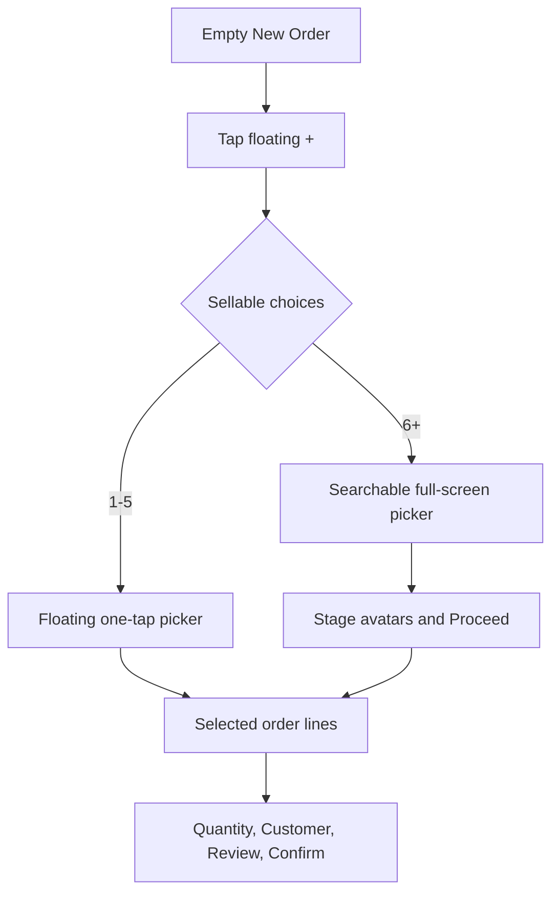

# Plan: Adaptive New Order Product Picker

## Type
Feature

## Status
Done

## Created Date
2026-07-23

## Last Updated
2026-07-24

## Goal Or Problem
Replace the mobile Create Order catalog-first screen with an empty order canvas
and floating add-item action that scales from a compact picker to a searchable
full-screen picker.

## Current Context
Mobile order creation already uses sellable Offerings, immutable price and
inventory snapshots, paginated Catalog queries, customer selection, payments,
and an offline Commercial Order queue. The current Items step renders every
loaded Offering and edits quantity inline.

## Proposed Approach
Keep the existing Commercial Order and Catalog contracts. Render only selected
order lines on the Items step, open a one-tap floating sheet for at most five
sellable choices, and open a staged multi-select full-screen picker above that
threshold. New lines start at quantity one.

## Visual Plan

## Implementation Steps
- Add a tested selection model for the adaptive threshold and staged commits.
- Replace the catalog-first Items step with an empty state and selected lines.
- Add the floating sheet, full-screen picker, avatar strip, search, and FAB.
- Preserve customer, payment, snapshot, pagination, and offline behavior.
- Run focused mobile checks and device UI QA.

## Affected Files Or Areas
- Mobile create-sale components and selection model.
- Shared mobile bottom-search footer.
- Mobile Create Sale QA guard and Project Brain documentation.

## Acceptance Criteria
- Five or fewer choices use a one-tap floating picker.
- Six or more choices use a searchable full-screen staged picker.
- The order begins empty and keeps a floating add-item FAB.
- Selected lines return with quantity one and remain editable.
- Existing Commercial Order, payment, and offline contracts remain intact.

## Test Plan
- Unit-test threshold and staged selection/quantity commits.
- Run Create Sale, pagination, keyboard, theme, NativeWind, and TypeScript checks.
- Validate empty, five-choice, six-choice, search, removal, and checkout states
  on an Android emulator.

## Risks / Edge Cases
- Incomplete pagination must never incorrectly choose the compact picker.
- Picker cancellation must not mutate the canonical order draft.
- FAB and sticky footer must remain safe-area and keyboard aware.
- Missing images must fall back to initials or kind icons.

## Outcome
- Delivered the empty order canvas and safe-area-aware floating add-item FAB.
- Added a one-tap detached picker for up to five sellable choices and a
  paginated, searchable full-screen staged picker above five.
- Added the fixed selected-avatar strip, X removal badges, reference-led
  circular row selectors, quantity preservation, and one-unit defaults.
- Preserved the existing customer, payment, snapshot, offline, and Commercial
  Order contracts.
- Android QA verified the authenticated empty order canvas and corrected a
  development theme-toggle collision with the FAB. Focused model tests and
  source guards cover the five/six split, selectable-choice filtering,
  no-progress pagination, staged commits, search, removal, and checkout seams.

## Skipped Or Deferred Validation
- Android interaction checks for exact five-choice, six-choice, search,
  avatar removal, and checkout states remain unverified on-device. The
  authenticated local QA business exposed one active sellable choice, and the
  repository's disposable real-session seeder is currently blocked by newer
  required business-profile signup fields. These scenarios are covered at the
  pure model and integration-guard seams, but should be repeated on Android
  when a matching multi-item fixture is available.

## Open Questions
- None.

## Linked Task
- Task Title: Implement adaptive New Order product picker
- Task File: .brain/tasks/done.md
