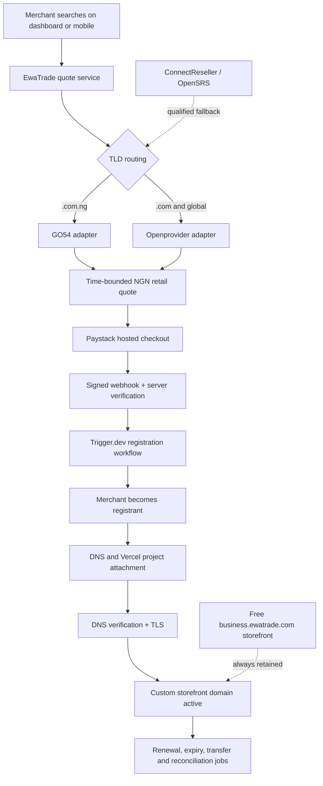

# Plan: Managed Domain Purchasing And Storefront Connection

## Type

Feature

## Status

Source implemented; deployment blocked

## Created Date

2026-07-24

## Last Updated

2026-07-24

## Objective

Give an EwaTrade business owner one safe, simple flow to search, pay for,
register, connect, renew, and transfer a storefront domain from either the
mobile app or the web dashboard. The launch offer should be deliberately small:
standard-price `.com.ng` and `.com` registrations for one year, automatic
storefront connection, a verified bring-your-own-domain path, and renewal
management.

The recommended production architecture is:

- **GO54 / WhoGoHost for `.com.ng`**. It is a NiRA-accredited Nigerian
  registrar with a documented reseller API covering availability,
  registration, renewal, transfer, contacts, EPP codes, DNS, nameservers, and
  registrar lock. Its API setup is free, accounts are prepaid, staging is
  available by request, and the current public retail table is denominated in
  naira. This recommendation is conditional on a successful sandbox spike and
  written confirmation of reseller prices, support escalation, and merchant
  registrant ownership.
- **Openprovider for global domains, beginning with `.com`**. Its product is
  explicitly designed for resellers and SaaS builders, with a REST/OpenAPI
  interface, broad TLD coverage, and wholesale pricing through membership.
  Its official support notice currently says the OT&E sandbox is impaired and
  that a replacement is expected on 2026-07-27, so a restored sandbox and a
  successful acceptance spike are launch gates. Use GO54 for `.com` during an
  intentionally lower-complexity pilot if opening and funding a second
  provider would delay launch.
- **OpenSRS as the mature global fallback**. Its Horizon test environment,
  established white-label reseller model, customer profiles, and broad
  lifecycle coverage make it the safer operational alternative if
  Openprovider's sandbox or commercial due diligence fails. Its XML/XCP API
  and IP allowlisting make it less attractive as the default developer
  experience.
- **ConnectReseller as the cross-provider commercial fallback**. It publicly
  lists both `.com.ng` and `.com`, offers a white-label reseller model, DNS
  management, API access, no setup/yearly fee, and no minimum commitment. It
  should be tested if GO54 activation/support or Openprovider commercial terms
  fail the launch gate.
- **Vercel for hosting, DNS/SSL, and project-domain attachment, not as the
  default merchant registrar**. Vercel now has a capable Registrar API, but its
  API Terms prohibit helping a third party resell or distribute the services
  through the API unless Vercel expressly permits it. Its public domain model
  also makes domains team-owned and can make the Vercel team owner the
  registrant when the registrant cannot otherwise be identified. Therefore,
  do not use Vercel as the customer registrar without express written
  reseller authorization and proof that each merchant remains the named
  registrant with practical transfer-out rights.
- **Cloudflare is a DNS option, not the launch registrar**. Its Registrar API
  beta can search, return real-time prices, and register a subset of supported
  TLDs, but it does not yet expose renewal, transfer, or contact-update APIs and
  Cloudflare-registered domains must remain on Cloudflare nameservers. Revisit
  it after the lifecycle API and a reseller/account-isolation model mature.
- **Paystack for the first NGN checkout adapter**. Payment is separate from
  registration: Paystack collects the merchant's money; the registrar deducts
  the wholesale cost from EwaTrade's funded registrar account; Vercel connects
  the resulting domain to the storefront. Paystack's hosted checkout,
  transaction verification, reusable authorizations, and signed webhooks fit
  both web and Expo flows. Keep the payment boundary provider-neutral so this
  does not force the separate subscription-billing decision.

Primary research is captured in
`.brain/research/2026-07-24-com-ng-domain-api.md` and
`.brain/research/domain-provider-evaluation.md`, with an independent
primary-source cross-check in
`.brain/research/2026-07-24-domain-provider-primary-source-review.md`.

## Assumptions

- The purchased domain is a public storefront address, never an authenticated
  dashboard host, consistent with ADR-0011.
- The tenant pays for and administers the domain, but the connection is to one
  Store/Site. This preserves the existing store-level Publish Site entitlement
  and supports future multi-store tenants.
- The merchant or merchant's legal entity is always the registrant. EwaTrade
  may be the reseller and technical contact, but must not silently become the
  beneficial registrant.
- Launch supports new one-year registrations for standard-price `.com.ng` and
  `.com` names only. Premium domains, auctions, inbound transfers, email
  hosting, advanced DNS editing, bulk portfolios, and additional TLDs are
  post-MVP.
- Domain purchase, connection, renewal, and transfer are online-only. They are
  never queued through the mobile offline-command system.
- A business keeps its free `<tenant>.ewatrade.com` storefront fallback even
  after a custom domain becomes active or later expires.
- EwaTrade will maintain prefunded registrar balances and a payment/refund
  reserve. A customer payment must not be treated as proof of successful
  registration.
- Registrar, registry, payment, exchange-rate, tax, and gateway costs can
  change. Every displayed price is a short-lived quote with the first-year and
  renewal amounts shown separately.
- This plan is a recommendation, not authorization to open paid provider
  accounts, accept provider contracts, buy live domains, or change production
  DNS.

## Current Context

- EwaTrade already has a shared authenticated dashboard, public storefront
  hostnames, `TenantHostname`, Store/Site models, a Vercel project-domain
  utility, provider-neutral subscription checkout intents, Prisma repository
  boundaries, and Trigger.dev jobs.
- ADR-0011 reserves `<business>.ewatrade.com` for the public storefront and
  forbids tenant-specific authenticated dashboard domains.
- Domain registration, customer billing, DNS hosting, storefront attachment,
  and subscription entitlement are separate responsibilities. The design must
  preserve those boundaries and keep the free EwaTrade storefront subdomain
  available as a fallback.
- The existing Vercel helper only attaches domains to projects. It is useful
  connection infrastructure, not a registrar ownership ledger.

## Proposed Approach

Build one EwaTrade-owned managed-domain service with provider adapters:
GO54 for `.com.ng`, Openprovider for `.com` and later global TLDs, Paystack for
customer collection, Trigger.dev for durable orchestration, and Vercel for
storefront attachment and TLS. Keep ConnectReseller and OpenSRS as qualified
fallback registrars. Treat every customer-visible price as a short-lived quote,
keep the merchant as registrant, separate payment/registration/connection
state, and expose the same server contracts to dashboard and mobile.

## Visual Plan

## Suggested Delivery Window And Ownership

With one backend/platform engineer, one dashboard engineer, and one mobile
engineer working in parallel, target **10-12 weeks after provider sandbox and
commercial access are available**:

- Weeks 1-2: provider/legal acceptance gate, sandbox spikes, pricing policy,
  registrant ownership, and ADR.
- Weeks 3-4: Prisma model, repository/service boundaries, fake adapter, GO54
  adapter, and global-provider adapter.
- Weeks 5-6: Paystack checkout, signed webhook verification, Trigger.dev
  registration/refund orchestration, and reconciliation.
- Weeks 7-8: Vercel/DNS/TLS connection, protected APIs, dashboard workflow, and
  support/admin visibility.
- Weeks 9-10: mobile workflow, renewal/expiry/transfer jobs, notifications,
  abuse controls, fault-injection tests, and runbooks.
- Weeks 11-12: owner-approved live canaries, cohort rollout, incident fixes,
  and launch review.

Provider contracting, legal/privacy review, finance/tax review, and support
runbook ownership are part-time parallel workstreams. A single full-stack
engineer should plan for roughly **16-20 weeks**, because provider onboarding,
web, mobile, lifecycle automation, and failure testing cannot safely collapse
into one simple checkout feature.

## Detailed Execution Plan

### Phase 0: Commercial and provider acceptance gate

Dependencies: none. This phase blocks production implementation.

1. Open a GO54 reseller application and obtain:
   - the signed reseller agreement and current NiRA registrant agreement;
   - API credentials and staging access;
   - the wholesale registration, renewal, restore, transfer, privacy, and
     premium-domain price schedule for `.com.ng` and `.com`;
   - rate limits, maintenance policy, status page, support escalation path,
     wallet funding methods, low-balance behavior, and reconciliation process;
   - written confirmation that the merchant details submitted through the API
     become the registry registrant details and that EPP/transfer-out remains
     available.
2. Open an Openprovider sandbox account only after verifying that the provider
   has restored the impaired OT&E environment identified in its 2026-07-24
   support notice. Request live commercial pricing for `.com`, then confirm
   account-funding, membership, tax, currency, registrant, WHOIS/privacy,
   polling/reconciliation, support, and transfer-out terms.
3. Open a no-cost ConnectReseller evaluation account if either primary provider
   cannot meet the acceptance gate. Obtain its API manual, test environment,
   IP allowlisting rules, wallet flow, and `.com.ng` registrant semantics.
4. Run an integration spike against non-production environments:
   - authenticate without clock-skew failures;
   - search availability and retrieve authoritative price;
   - create a customer/registrant contact;
   - register a test domain;
   - set and read nameservers/DNS;
   - read lifecycle status;
   - exercise renewal or the provider's documented renewal simulation;
   - retrieve or verify the transfer/EPP path;
   - reconcile a simulated timeout after a potentially successful write.
5. Score the providers using fixed weights:
   - 25% lifecycle API correctness and completeness;
   - 20% merchant ownership, transfer, and contract clarity;
   - 15% sandbox quality and developer ergonomics;
   - 15% registration plus renewal landed cost;
   - 10% support and incident escalation;
   - 10% DNS/DNSSEC/privacy capability;
   - 5% NGN funding, invoicing, and tax simplicity.
6. Record the accepted providers and routing rule in an ADR before production
   code is merged.

Decision points:

- Choose GO54 for `.com.ng` only if the spike passes and ownership is confirmed
  in writing. Otherwise use ConnectReseller / OwnRegistrar as the launch
  fallback.
- Choose Openprovider for `.com` if its restored sandbox passes and its landed
  renewal economics justify a second integration. Use OpenSRS if
  Openprovider's sandbox or operating terms fail. Otherwise route both
  `.com.ng` and `.com` through GO54 for the pilot, while preserving the
  adapter boundary.
- Do not use Vercel as registrar unless its commercial/legal response resolves
  team ownership, registrant identification, resale permission, billing,
  transfer-out, and support responsibility.

Validation:

- A signed provider decision record, actual API fixtures, an approved price
  sheet, and a completed risk questionnaire exist before Phase 2 begins.

### Phase 1: Freeze the launch product and customer promises

Dependencies: Phase 0 commercial facts.

1. Define the MVP product:
   - supported TLDs: `.com.ng` and `.com`;
   - one-year standard registrations only;
   - one active primary custom storefront domain per Store;
   - merchant-named registrant;
   - automatic apex and `www` connection;
   - manual renewal plus optional automatic renewal consent;
   - transfer-out available to the verified owner;
   - existing-domain connection as a separate flow.
2. Define what is not promised:
   - search results do not reserve a name;
   - successful payment does not guarantee registration;
   - domain purchases are non-refundable after successful registration;
   - DNS/SSL can remain pending after registration;
   - email hosting is not included;
   - renewal price may differ from first-year price.
3. Define the commercial formula rather than hard-coding a public price:
   - registrar wholesale cost;
   - exchange-rate and foreign-card cost where applicable;
   - payment-gateway fee;
   - taxes;
   - a small operational contingency;
   - EwaTrade's fixed or percentage service margin.
4. Show registration and current renewal price side by side everywhere. Do not
   use a cheap first-year promotion without displaying the current renewal
   amount equally prominently.
5. Give quotes a short TTL, recommended at 10 minutes. At checkout, require the
   exact quote ID and reject or reconfirm if the provider cost changed.
6. Define refund behavior:
   - definitive registration failure after payment: automatic full refund;
   - unknown provider outcome: reconcile before retrying or refunding;
   - registration succeeded but Vercel/DNS failed: no refund of the registered
     domain; keep retrying the connection and offer support;
   - never substitute a different domain without explicit customer approval.
7. Obtain counsel review of the NiRA registrant agreement, relevant ICANN/TLD
   terms, EwaTrade domain-service terms, privacy notice, renewal consent,
   transfer policy, refund language, and abuse process.

Validation:

- Product, support, finance, and legal sign off on one customer-facing policy
  pack and one price calculation specification.

### Phase 2: Add a dedicated managed-domain data model

Dependencies: accepted ownership and lifecycle semantics from Phases 0-1.

1. Add `packages/db/prisma/models/domains.prisma` with explicit aggregates,
   rather than placing registrar state inside `TenantHostname.metadata`:
   - `DomainRegistrantProfile`: tenant-owned legal/contact data and consent
     version, with tightly restricted reads;
   - `DomainQuote`: normalized domain, TLD, provider, provider cost, retail
     amount, currencies, exchange rate, premium flag, and expiry;
   - `DomainOrder`: tenant, Store/Site, quote snapshot, requested period,
     payment state, registration state, idempotency key, and terms acceptance;
   - `ManagedDomain`: provider, provider domain id, normalized ASCII hostname,
     Unicode display value if later supported, registrant, lifecycle status,
     registration/expiry dates, renewal mode, and transfer state;
   - `DomainConnection`: Managed Domain or external-domain reference,
     Store/Site, surface, verification token, Vercel project assignment,
     DNS/SSL state, primary state, and activation timestamps;
   - `DomainEvent`/`DomainOperationAttempt`: append-only audit of payment,
     registrar, DNS, verification, renewal, transfer, refund, and operator
     actions.
2. Keep payment, registration, and connection states separate. The useful
   happy path is:
   `QUOTED -> PAYMENT_PENDING -> PAID -> REGISTERING -> REGISTERED`, followed
   independently by
   `DNS_CONFIGURING -> VERIFYING -> ACTIVE`.
3. Include explicit exception states:
   `REGISTRATION_UNCERTAIN`, `REGISTRATION_FAILED`, `REFUND_PENDING`,
   `CONNECTION_FAILED`, `EXPIRED`, `REDEMPTION`, `SUSPENDED`, and
   `TRANSFERRED_OUT`.
4. Keep `TenantHostname` as the request-routing projection. Only create or mark
   a custom storefront hostname verified after `DomainConnection` is active.
   Do not use `TenantHostname.isPrimary` as the source of registrar ownership
   or renewal truth.
5. Make Store/Site attachment explicit. Tenant ownership alone is insufficient
   for a future multi-store account.
6. Store money as integer minor units and exact provider currency snapshots.
   Never recompute what a customer paid from a current TLD price.
7. Encrypt or otherwise application-protect registrant PII according to the
   repository's chosen secrets/data-protection pattern. Never put provider
   secrets or full registrant payloads in logs.
8. Add repository methods in `packages/db/src/queries/domains.ts` with tenant
   authorization, idempotent commands, optimistic transition guards, and safe
   client projections.
9. Follow the repository Prisma workflow: generate the migration through the
   root scripts, then run all required local, production, and attempted remote
   push profiles. Do not hand-write migration files.

Validation:

- Model tests prove tenant isolation, one active primary domain per Store,
  quote immutability, legal state transitions, idempotent order creation, and
  no unverified hostname activation.

### Phase 3: Build provider-neutral server adapters

Dependencies: Phase 0 fixtures and Phase 2 domain types.

1. Add a server-only `@ewatrade/domains` workspace package used by both the API
   and Trigger.dev jobs.
2. Define a narrow registrar contract:
   - `checkAvailability`;
   - `getPrice`;
   - `registerDomain`;
   - `getDomain`;
   - `renewDomain`;
   - `getNameservers` / `setNameservers`;
   - `getContacts` / `updateContacts`;
   - `setRegistrarLock`;
   - `getTransferCode`;
   - `getBalance` when supported;
   - `reconcileOperation`.
3. Normalize provider responses into EwaTrade-owned types. Provider error codes,
   IDs, and raw payloads stay inside the adapter/audit boundary and never leak
   into dashboard or mobile contracts.
4. Implement GO54 first, including its time-derived authentication token.
   Centralize UTC clock use, tolerate documented clock windows, and alert on
   clock drift.
5. Implement Openprovider for `.com` only after GO54 contract tests pass. If the
   launch uses GO54 for both TLDs, implement the second adapter after the first
   controlled cohort without changing client APIs.
6. Add a provider router based on TLD and configuration, not UI choice.
   Provider failover is allowed before payment or after a definitive failure;
   it is never automatic while a registration result is uncertain.
7. Extend the existing Vercel integration as a separate connection adapter:
   - add apex and `www` to the configured storefront project;
   - obtain current required DNS/nameserver instructions;
   - request verification;
   - poll project-domain configuration and SSL state;
   - remove project assignment only through an explicit disconnect workflow.
8. Do not hard-code Vercel project names or DNS targets. Continue using the
   configured storefront project ID so the current early
   `ewatrade-marketing` project can later be replaced by the dedicated
   storefront project without changing domain ownership records.
9. Add contract tests from sanitized provider fixtures and negative cases:
   price mismatch, unavailable after search, insufficient wallet balance,
   invalid contact, premium name, provider timeout, duplicate request, and
   successful write followed by a lost response.

Validation:

- The same service tests pass against every enabled registrar adapter and a
  deterministic fake adapter.

### Phase 4: Implement payment, registration, and refund orchestration

Dependencies: Phases 2-3 and a live/test Paystack account.

1. Add a payment adapter with Paystack as the first implementation. Initialize
   every checkout server-side using the exact `DomainOrder` amount and a unique
   reference.
2. Use Paystack hosted checkout:
   - web dashboard redirects or opens the hosted checkout;
   - Expo uses the secure system browser and an app/deep-link callback;
   - neither client receives Paystack or registrar secret keys.
3. Add a signed Paystack webhook endpoint. Verify signature, reference,
   currency, amount, tenant/order relation, and replay idempotency before
   changing payment state.
4. Treat the webhook or server-side verification as authoritative; a browser
   callback alone never delivers the domain.
5. On confirmed payment, enqueue a Trigger.dev registration job. The job:
   - locks the order transition;
   - rechecks availability and provider price;
   - submits the merchant registrant and configured nameservers;
   - records the provider request fingerprint;
   - reconciles an uncertain result before any retry;
   - stores registration/expiry facts;
   - starts the Vercel connection job.
6. If a definitive registration failure occurs, enqueue a full Paystack refund
   and keep retrying/refunding idempotently until confirmed. Notify the owner
   that the name was not acquired.
7. If registration succeeds and connection fails, preserve the domain,
   continue provisioning retries with bounded backoff, keep the EwaTrade
   subdomain live, and open an operator alert.
8. Add a reconciliation schedule for:
   - paid orders not yet registered;
   - uncertain provider operations;
   - registered domains not connected;
   - refund-pending orders;
   - local expiry/status drift against the registrar.

Validation:

- Fault-injection tests prove there is no double charge, double registration,
  premature refund, or hostname activation across retries and process crashes.

### Phase 5: Automate DNS, Vercel, SSL, and canonical storefront behavior

Dependencies: successful registration orchestration.

1. For newly purchased domains, delegate nameservers to the selected
   authoritative DNS provider. The simplest launch path is Vercel DNS because
   the storefront already runs there and project connection/SSL becomes
   automatic.
2. Fetch or configure the current Vercel nameserver/DNS requirements; do not
   rely on copied constants that can change.
3. Add both apex and `www`, with one canonical hostname and an explicit
   redirect for the other.
4. Poll DNS visibility, Vercel verification, and certificate state. Mark the
   connection active only when the project accepts the domain and HTTPS works.
5. Once active:
   - create/update the verified custom `TenantHostname`;
   - attach it to the target Store/Site through `DomainConnection`;
   - make it the storefront canonical URL;
   - keep the internal tenant storefront hostname as fallback;
   - update share-link and metadata selection through the existing verified
     custom-host preference.
6. If the domain expires, is suspended, or loses verification, stop treating it
   as canonical and fall back to `<tenant>.ewatrade.com` without exposing an
   authenticated surface.
7. For newly purchased domains, include basic DNS records only. Add email MX,
   SPF, DKIM, DMARC, advanced DNS, or external hosting controls as later
   products.

Validation:

- Automated probes verify apex, `www`, redirect, TLS certificate, storefront
  tenant resolution, canonical metadata, share links, and internal-subdomain
  fallback.

### Phase 6: Add safe APIs and permissions

Dependencies: Phases 2-5.

1. Add `apps/api/src/trpc/routers/domains.ts` with:
   - `domains.search`;
   - `domains.getQuote`;
   - `domains.getRegistrantProfile`;
   - `domains.saveRegistrantProfile`;
   - `domains.createCheckout`;
   - `domains.getOrder`;
   - `domains.list`;
   - `domains.get`;
   - `domains.retryConnection`;
   - `domains.renew`;
   - `domains.setRenewalPreference`;
   - `domains.startExternalConnection`;
   - `domains.verifyExternalConnection`;
   - `domains.disconnect`;
   - owner-only transfer preparation/support request.
2. Require authenticated tenant context and validate Store/Site membership at
   every boundary.
3. Allow owners/admins to search and connect domains. Require owner
   confirmation for registrant changes, auto-renew consent, disconnect,
   transfer-out, or any action that could lose the domain.
4. Normalize domains using an allowlisted TLD parser and IDNA/punycode rules.
   Reject URLs, ports, credentials, paths, IPs, localhost names, public-suffix
   confusion, unsupported Unicode, reserved EwaTrade hosts, and unapproved
   TLDs.
5. Rate-limit availability search per user/tenant/IP and cache identical
   provider lookups briefly without treating cached availability as a
   reservation.
6. Return only safe registrant summaries to clients. Do not return raw provider
   payloads, API errors containing PII, auth/EPP codes, or secrets.
7. Add immutable audit events for terms acceptance, payment, registrant edits,
   renewal preference, DNS changes, transfer requests, and operator actions.

Validation:

- Authorization and abuse tests cover cross-tenant access, staff roles,
  malformed/Unicode domains, search flooding, replayed checkout requests, and
  unverified custom-domain takeover attempts.

### Phase 7: Build the dashboard domain workspace

Dependencies: stable APIs from Phase 6.

1. Before UI work, inspect the closest Midday Settings/domain analogue and
   create the required file-level migration checklist.
2. Extend `apps/dashboard/src/app/(shell)/settings/page.tsx` with a focused
   Domains section, or a nested `/settings/domains` workspace if the Midday
   reference favors it.
3. Provide three clear actions:
   - `Buy a domain`;
   - `Connect a domain I already own`;
   - `Manage` an existing domain.
4. Purchase flow:
   - search business name;
   - show `.com.ng` first and `.com` second;
   - show available/unavailable, first-year price, renewal price, and quote
     expiry;
   - collect/review registrant details;
   - show non-refundable-after-registration and renewal terms;
   - open Paystack checkout;
   - return to an order progress screen that continues through registration,
     DNS, and SSL without requiring the page to remain open.
5. Management view:
   - domain and target Store;
   - registered/connected/SSL status;
   - registrant summary;
   - purchase and expiry dates;
   - first/current renewal amount;
   - renewal preference and payment health;
   - retry/support affordance;
   - transfer-out and disconnect explanations.
6. Use Midday server prefetch/hydration, tRPC mutation/invalidation, URL-owned
   sheet state, skeletons, empty/error states, and global sheet conventions.
7. Replace the current signup custom-domain behavior. Signup may continue
   reserving the free EwaTrade subdomain, but it must not create custom
   `TenantHostname` rows from unverified text. At most, a post-signup prompt can
   route to `Buy` or `Connect existing`.

Validation:

- Browser QA covers purchase success, cancellation, price expiry, domain race,
  provider delay, Vercel delay, refund, BYOD verification, renewal, responsive
  layout, and refresh/resume of an in-progress order.

### Phase 8: Build the mobile domain workspace

Dependencies: dashboard flow and stable shared API behavior.

1. Add a `Website & domain` row to the admin `More` area and create a focused
   full-screen `domain-management-modal.tsx`.
2. Reuse the same API, state language, legal copy, price quote, and order
   progress model as dashboard; do not build mobile-specific registrar logic.
3. Use the system browser for Paystack checkout and a verified deep link back
   to the order. On return, refetch server state; do not trust callback query
   parameters as payment proof.
4. Make the workflow explicitly online-only and show a useful offline state
   before the user enters checkout.
5. Allow the app to close during registration/DNS provisioning. Push/email/in-
   app notifications and the persisted status screen communicate completion
   or required action.
6. Keep the initial mobile scope to search, purchase, status, renewal
   preference, and high-level support. Complex DNS/contact/transfer operations
   can deep-link to the responsive dashboard until a native workflow is
   justified.

Validation:

- iOS and Android QA covers browser handoff, deep-link return, app kill/resume,
  duplicate taps, offline entry, authentication expiry, delayed webhook, and
  completed provisioning notification.

### Phase 9: Implement bring-your-own-domain as a separate secure path

Dependencies: Vercel connection adapter and verified hostname projection.

1. Normalize the submitted hostname and create a random, single-use ownership
   token.
2. Prefer a TXT ownership challenge before project attachment. Return exact
   DNS instructions and verify them server-side.
3. After ownership is proven, add the domain to Vercel and return the provider-
   specific A/CNAME or nameserver changes needed for storefront routing.
4. Never automatically replace authoritative nameservers for an existing
   domain. Warn that nameserver changes can break existing website and email
   records; offer record-level A/CNAME configuration by default.
5. Do not mark the hostname verified until both ownership and Vercel
   configuration succeed.
6. Continuously revalidate configuration and fall back safely if it drifts.

Validation:

- Tests prove a user cannot claim another tenant's hostname, a domain already
  used by another Vercel account requires the correct challenge, and email DNS
  is not silently destroyed.

### Phase 10: Renewal, expiration, transfer, and operations

Dependencies: active domains and payment adapter.

1. Do not rely only on registrar auto-renew. EwaTrade owns the customer
   billing relationship and must know whether renewal payment succeeded.
2. For automatic renewal:
   - capture explicit merchant consent and a reusable Paystack authorization;
   - attempt customer charge around 30 days before expiry;
   - after successful charge, renew immediately through the registrar;
   - retry payment at safe intervals such as 21, 14, and 7 days before expiry;
   - never charge after cancellation or transferred-out state.
3. Send reminders at least 60, 30, 14, 7, and 1 day before expiry, adjusted to
   the applicable registry rules and provider capability.
4. Surface current renewal price before charging. If it changed materially,
   require reconfirmation according to the approved policy.
5. Monitor registrar wallet balance and forecast the next 45 days of renewals.
   Alert well before the wallet could block a registration or renewal.
6. Reconcile registrar lifecycle status daily and more frequently near expiry.
7. Build transfer-out as a verified owner workflow:
   - confirm account/session and recent re-authentication;
   - disclose any registry transfer lock;
   - unlock and retrieve EPP/auth code only when allowed;
   - transmit sensitive codes through a secure, short-lived channel;
   - stop future billing only after transfer state is authoritative.
8. Create an operator runbook for registration uncertainty, wallet depletion,
   provider outage, registry rejection, clientHold/contact verification,
   DNS/SSL failure, chargeback, abuse report, expiration, redemption, and
   provider migration.
9. Track service metrics:
   search-to-checkout conversion, payment success, registration success,
   median time to HTTPS active, uncertain operations, refunds, renewal success,
   domains within 30 days of expiry, wallet runway, and support tickets per
   100 domains.

Validation:

- Time-shifted lifecycle tests cover price changes, failed auto-renewal,
  insufficient provider balance, grace/redemption states, transfer lock,
  transferred-out cancellation, and safe fallback storefront URLs.

### Phase 11: Rollout and go/no-go criteria

Dependencies: all MVP phases and operational readiness.

1. Launch internally with provider sandbox/test accounts.
2. With explicit owner approval for the non-refundable action, buy one
   controlled `.com.ng` canary and one controlled `.com` canary. Verify
   registrant record, payment reconciliation, DNS, Vercel project attachment,
   TLS, renewal settings, EPP/transfer path, and invoices.
3. Run a staff-only cohort, then 10-business, 50-business, and general
   availability cohorts.
4. Stop expansion if any of these thresholds fail:
   - merchant is not the registrant;
   - paid-but-uncertain orders cannot be reconciled reliably;
   - refund automation is not idempotent;
   - domain activation success is below the agreed SLO;
   - wallet monitoring or renewal alerts are not operational;
   - transfer-out is unavailable;
   - support escalation cannot resolve a canary incident.
5. After stable volume, add TLDs based on measured searches, not a large static
   catalog. Evaluate direct NiRA accreditation only when portfolio volume and
   margin savings justify registry deposits, certification, annual
   recertification, policy obligations, and direct EPP operations.

MVP definition of done:

- A merchant can complete the same domain search and purchase from dashboard
  and mobile.
- `.com.ng` and `.com` show authoritative, time-bounded first-year and renewal
  prices.
- Payment, registration, DNS, SSL, refund, renewal, and transfer states are
  durable, auditable, idempotent, and resumable.
- The merchant is the registrant and can transfer out.
- A registered domain automatically reaches the intended Store storefront over
  HTTPS, while the free EwaTrade subdomain remains a fallback.
- An already-owned domain cannot activate without ownership verification.
- Owners receive renewal reminders, and failed renewal/payment states are
  visible before expiry.
- Provider secrets and registrant PII are not exposed to clients or logs.
- Brain database, API, feature, decision, task, and operational docs are
  updated with the implemented behavior.

## Affected Files Or Areas

- `packages/db/prisma/models/` and `packages/db/src/queries/`
- New server-only registrar/domain orchestration package under `packages/`
- `apps/api/src/trpc/routers/` and signed payment/provider webhook routes
- `packages/jobs/src/tasks/`
- `packages/utils/src/vercel.ts` or a dedicated storefront-connection adapter
- Dashboard Settings domain workspace
- Mobile Website & Domain management flow
- Storefront hostname resolution and canonical URL selection
- Environment configuration, secrets, alerts, operator runbooks, and Brain
  database/API/feature/decision documentation

## Acceptance Criteria

- The MVP definition of done above passes for both `.com.ng` and `.com` from
  dashboard and mobile.
- Provider acceptance spikes prove merchant-as-registrant ownership, lifecycle
  API coverage, idempotent recovery, and transfer-out before production launch.
- Registration, payment, DNS, TLS, renewal, refund, and transfer actions are
  auditable and resume safely after timeouts or process restarts.
- The free EwaTrade storefront subdomain remains operational throughout custom
  domain provisioning and failure states.

## Test Plan

- Adapter contract tests against deterministic fakes and sanitized provider
  fixtures.
- Repository and service tests for tenant isolation, quote expiry, state
  transitions, idempotency, pricing snapshots, PII redaction, and authorization.
- Fault-injection tests for payment replay, registrar timeout, unknown outcome,
  wallet depletion, DNS/SSL delay, refund retry, renewal failure, and transfer
  lock.
- Dashboard browser QA plus iOS/Android checkout, deep-link, app-resume, and
  online-only behavior.
- Two owner-approved live canaries—one `.com.ng` and one `.com`—before cohort
  rollout.

## Open Questions

- TODO: Confirm GO54 staging access, wholesale rates, rate limits, support SLA,
  wallet funding, and merchant registrant/transfer terms in writing.
- TODO: Confirm Openprovider's replacement sandbox is operational after its
  announced 2026-07-27 target and passes the acceptance suite.
- TODO: Decide whether launch routes `.com` through GO54 temporarily or opens a
  second funded registrar account from day one.
- TODO: Approve the retail pricing formula, FX source/buffer, margin, taxes,
  refund reserve, and renewal-price change policy.
- TODO: Complete legal/privacy review for NiRA/ICANN terms, NDPA registrant
  data handling, refund language, renewal consent, and abuse/dispute handling.
- TODO: Confirm mobile store-policy treatment and the approved Paystack
  browser/deep-link checkout experience.

## Linked Task

- Task Title: Managed domain purchasing and storefront connection
- Task File: `.brain/tasks/roadmap.md`

## Skills List Used

- `brain-plan`: grounded the feature plan in EwaTrade's Project Brain and
  persisted it with proposed status, visual architecture, acceptance criteria,
  and a companion roadmap task.
- `research`: verified registrar, registry, API, pricing, payment, and Vercel
  facts against primary first-party sources and captured the findings in Brain.
- `plan`: converted the research and EwaTrade architecture into sequenced,
  dependency-aware implementation and validation phases without starting code.

## Risks and Mitigations

- **A domain can be taken after search but before registration.** Use short
  quotes, recheck before the provider write, make no reservation promise, and
  automatically refund definitive failures.
- **A provider timeout can hide a successful registration.** Persist request
  fingerprints, move to `REGISTRATION_UNCERTAIN`, reconcile before retry or
  refund, and never fail over while outcome is unknown.
- **EwaTrade could accidentally become the registrant.** Require merchant
  registrant details, provider contract confirmation, registry verification in
  canaries, and a transfer-out acceptance test.
- **Registrar wallet depletion can block purchases and renewals.** Maintain a
  reserve, forecast 45-day demand, monitor balance, alert early, and stop new
  checkout before accepting money when capacity is unsafe.
- **Promotional first-year prices can create renewal surprise.** Display
  renewal beside registration, snapshot both, notify before charging, and
  avoid pricing below sustainable renewal economics.
- **USD registrar costs create NGN FX exposure.** Use expiring backend quotes,
  an approved FX source and buffer, provider routing by landed cost, and
  periodic margin review.
- **Vercel coupling can create ownership and outage concentration.** Keep
  registrar ownership independent, represent connection separately, preserve
  the EwaTrade subdomain, and keep provider adapters replaceable.
- **Changing DNS can break merchant email.** New purchases can use managed
  nameservers; existing domains default to targeted A/CNAME plus TXT
  verification and never replace nameservers silently.
- **Renewal payment can fail before expiry.** Charge early, retry safely,
  notify through multiple channels, expose manual renewal, maintain accurate
  lifecycle reconciliation, and keep the fallback storefront live.
- **Provider prices, APIs, and policies can change.** Cache briefly, validate
  price at write time, use contract tests and health checks, version terms, and
  retain at least one tested alternate provider.
- **Registrant PII creates privacy and breach exposure.** Minimize fields,
  protect stored data, restrict reads, redact logs/events, define retention,
  and document registrar subprocessing under the NDPA/privacy review.
- **Premium, restricted, geographic, trademarked, or abusive names can be
  rejected.** Launch with standard-price names only, surface registry rules,
  require rights representations, and provide an abuse/dispute runbook.
- **Two providers increase engineering and operational load.** Implement one
  normalized contract and fake adapter first; launch both TLDs through GO54 if
  necessary, then enable Openprovider only when its economics outweigh the
  added complexity.
