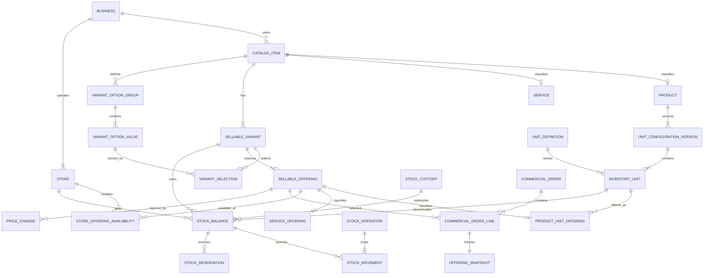

# Design The Durable Schema And Ledger Evolution

Parent: [Wayfinder: Catalog Variants, Product Units, And Sellable Offerings](../map.md)

Type: research

Status: resolved

Blocked by: 01, 02, 03, 04, 05, 12

## Question

What durable relational schema and stock-ledger evolution separates Sellable
Variants, Product Unit Offerings, Service Offerings, and configured Inventory
Units; represents exact/versioned Product unit factors and both stock
behaviors; and gives the new Product/Service prices, orders, Product inventory,
movements, reservations, and staff-wallet model internally consistent
relationships without retaining the old schema bridge?

## Comments

Design a clean relational model with explicit tables or constrained subtypes
for Catalog Items, Sellable Variants, Sellable Offerings, Product Unit
Offerings, Service Offerings, Unit Definitions, Product unit-configuration
versions, configured units, stock balances, and immutable stock movements.

Enforce tenant ownership, Product-versus-Service subtype exclusivity, one
canonical unit per configuration version, exact factors, unique balance
ownership, and same-variant transformations at database and service
boundaries. Orders and movements must reference immutable snapshots.

This is a replacement schema, not an evolution bridge. The design should
include an entity diagram, constraint list, ledger posting examples, and an
explicit list of old models and fields to remove.

## Resolution

### Relational shape

### Catalog and offering tables

- `CatalogItem` is business-owned and has immutable `kind`, lifecycle status,
  name, description, category, and media.
- `Product` and `Service` are exclusive one-to-one subtype rows keyed by
  `catalogItemId`; exactly one must agree with `CatalogItem.kind`.
- `SellableVariant` is an explicit row even for a simple item's implicit
  default. `VariantOptionGroup`, `VariantOptionValue`, and `VariantSelection`
  normalize merchant-authored option matrices.
- `SellableOffering` owns common lifecycle and Offering Pricing Policy fields.
  Exactly one same-key `ProductUnitOffering` or `ServiceOffering` subtype
  exists.
- `ProductUnitOffering` references one Sellable Variant and one Inventory Unit
  of that Variant's Product and owns optional SKU/barcode.
  `ServiceOffering` owns only Service-commercial identifiers.
- `StoreOfferingAvailability` enables one business-owned offering at one Store
  without moving catalog ownership or price to the Store.
- `PriceChange` is append-only and offering-owned. The offering may retain its
  current fixed-price projection, but history and Commercial Order snapshots
  are authoritative for past prices.

### Unit configuration tables

- `UnitDefinition` has exclusive Platform or Business ownership and contains
  display vocabulary and measurement meaning only.
- `UnitConfigurationVersion` belongs to one Product, carries a monotonically
  increasing version number, Draft/Current/Superseded status, and required
  Canonical Balance Precision.
- `InventoryUnit` belongs to one configuration version and snapshots its
  display name/symbol, optional Unit Definition provenance, exact positive Unit
  Factor, Transaction Precision, canonical flag, and exclusive Stock Behavior.
- Database decimals store entered quantities to 6 places, Unit Factors to 12
  places, and canonical calculations at `DECIMAL(38,18)` or an equivalent
  proven-safe precision. API and offline boundaries serialize them as strings.
- Publishing a semantic unit change creates new Inventory Units and new
  Product Unit Offerings where meaning changed. It never retargets a used
  offering. Activation and supersession are atomic; existing balances or
  reservations require a Stock Transition.

### Balance, reservation, and custody tables

- `StockBalance` is one explicit Balance Source identified by Business, Store,
  Sellable Variant, configuration/versioned Inventory Unit meaning, Stock
  Behavior, and optional Stock Custody.
- Each active Product variant has one central Shared Stock Pool denominated by
  its Current configuration's Canonical Inventory Unit. Alternate Transaction
  Units resolve to that row and never own rows.
- Each Packaged Stock Inventory Unit may have one central balance per Store and
  variant. Custody creates subordinate balances with the same unit meaning;
  it does not create another unit or factor.
- `StockReservation` holds an exact quantity and canonical effect against one
  Balance Source with Pending/Committed/Released/Expired lifecycle and offering
  and order-line provenance.
- `StockBalance` may keep transactionally updated on-hand and reserved
  projections for fast reads. They may never be independently edited and must
  reconcile to immutable movements and active reservations.

### Ledger tables

- `StockOperation` is an immutable posting header containing Business, Store,
  operation type, idempotency identity, source, reason, actor, custody/session
  context, effective time, and creation time.
- `StockMovement` is an immutable entry against one Stock Balance. It snapshots
  direction, entered Inventory Unit, entered quantity, Unit Configuration
  Version, Unit Factor, exact signed canonical effect, and before/after balance
  projections.
- Receipts, sales, returns, counts/reconciliation, adjustments, transfers,
  transformations, Stock Transitions, custody assignments, and custody returns
  use the same ledger rather than parallel metadata histories.
- A Stock Transformation is one Stock Operation with source-out and target-in
  movements. Both are in the same Business, Store, Product, and Sellable
  Variant and their canonical effects sum to zero. Loss is a separate
  adjustment.

### Commercial snapshots

- `CommercialOrderLine` references the selected Sellable Offering for
  provenance and owns a required one-to-one immutable `OfferingSnapshot`.
- The snapshot records Catalog Item/variant labels and options, offering
  subtype, pricing policy, accepted quote or fixed Unit Price, currency,
  merchant identifiers, and—only for Product lines—the Inventory Unit,
  configuration version, factor, Stock Behavior, and resolved Balance Source
  meaning used by fulfillment.
- Archiving or repricing catalog records never rewrites the snapshot.

### Required constraints

1. Every Catalog Item has exactly one Product or Service subtype matching its
   immutable kind and at least one Sellable Variant.
2. Each option selection belongs to a group on the same Catalog Item; a variant
   chooses at most one value per group; active combinations are unique.
3. Every Sellable Offering has exactly one immutable subtype matching its
   Catalog Item kind.
4. Fixed pricing requires one non-negative price in the Business Currency;
   quote-required pricing has no placeholder price. Zero means free.
5. Product SKU/barcode and Service merchant codes are business-unique when
   present.
6. A Product has at most one Current Unit Configuration Version and any number
   of immutable Superseded versions; only Draft is editable.
7. Every configuration has exactly one Canonical Inventory Unit. Its Unit
   Factor is exactly one and its behavior is canonical shared stock.
8. All Unit Factors are positive exact decimals; Transaction Precision is
   between zero and six; publication proves every allowed transaction has an
   exact canonical representation.
9. A Product Unit Offering's variant and Inventory Unit belong to the same
   Product. An active offering uses the Current configuration.
10. A Service Offering cannot reference configurations, units, balances,
    reservations, movements, or transformations.
11. Store Offering Availability and Stock Balances belong to Stores in the
    same Business as their catalog records.
12. A shared central balance is unique per Store, variant, and active
    configuration. A packaged central balance is unique per Store, variant,
    and Packaged Stock unit. Alternate units cannot own balances.
13. On-hand, reserved, and available quantities remain non-negative in normal
    operations; reserved cannot exceed on-hand.
14. A stock idempotency identity is unique within Business, Store, and
    operation type. Duplicate replay returns the original operation.
15. Stock Operation and Stock Movement rows are append-only. Transformations
    and transfers validate balanced entries before atomic commit.
16. Used catalog, offering, unit-version, order, reservation, price, and ledger
    records use restrictive deletion. Business-facing removal is archival.

Cross-row subtype, same-owner, publication, and balanced-ledger invariants must
be enforced in the transactional domain service as well as with all practical
foreign keys, unique indexes, check constraints, and restrictive delete rules.

### Ledger posting examples

**Simple Opening Stock**

- Product: Notebook; canonical Inventory Unit: Piece; factor `1`.
- Opening Stock: `100` pieces.
- Post one Opening Stock operation with an inbound movement of entered
  quantity `100`, factor `1`, canonical effect `+100` to the Shared Stock Pool.

**Alternate unit sale from a shared pool**

- Canonical unit: Kilogram; alternate selling unit: 250 g portion; factor
  `0.25`.
- Sell `3` portions.
- Post one sale movement to the Shared Stock Pool with entered quantity `3`,
  factor `0.25`, and canonical effect `-0.75` kilogram. No 250 g balance exists.

**Packaged Stock transformation**

- Large pack factor `1`; prepared half-pack factor `0.5`; both own Packaged
  Stock balances.
- Transform `50` large packs into `100` half-packs.
- One operation posts source effect `-50 × 1 = -50` and target effect
  `+100 × 0.5 = +50`. Canonical net is exactly zero.

**Custody transfer**

- Transfer `5` cartons from central Packaged Stock to one staff custody
  balance.
- One transfer operation posts `-5` cartons centrally and `+5` cartons to
  custody with the same configuration, unit, factor, and canonical meaning.

**Reservation and completion**

- Reserving `2` sellable units places an exact active hold against the
  offering's resolved Balance Source but does not create a Stock Movement.
- Completion posts the sale movement and commits/releases the hold atomically;
  cancellation releases it without fabricating inventory.

### Old schema removed

- Remove Product unit-template relations and the
  `ProductUnitTemplate`/`ProductUnitTemplateUnit` models.
- Remove ProductVariant price, SKU, conversion-ratio, unit-template, unit
  metadata, and InventoryItem relationship responsibilities.
- Replace `InventoryItem`, per-variant `StaffStockWallet`, and integer quantity
  fields with the resolved Balance Source, custody, reservation, and ledger
  tables.
- Replace ProductVariant-linked price history with offering-linked Price
  Changes.
- Replace ProductVariant/related-ProductVariant movement pairs with
  StockOperation/StockMovement postings.
- Replace ProductVariant order/cart selection with Sellable Offering selection
  and immutable Offering Snapshots.
- Delete legacy Service ids and the legacy Service migration bridge.
- Delete metadata dual writes, missing-table readers, ratio fallbacks, old
  offline compatibility, and feed/bag unit seeds.
- Regenerate Prisma artifacts after the replacement schema; do not preserve or
  manually edit generated old models.
