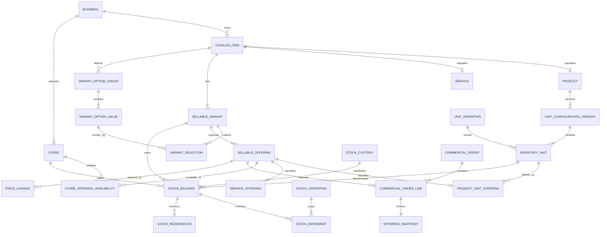

# Generic Catalog, Offerings, Inventory Units, And Stock Operations

Label: `implemented`

Status: source-complete-pending-behavioral-validation

## Problem Statement

EwaTrade currently treats a Product variant as several unrelated things at
once: a customer option, selling unit, priced SKU, conversion ratio, and stock
balance. The bridge creates one integer inventory bucket per unit-like variant,
uses binary-number conversion multipliers, and contains feed/bag-specific
fallbacks, seeds, forms, offline events, and tests.

That design cannot safely support a general merchant catalog. A Product may
have real variants such as colour or size, may be sold through several units
that share one stock pool, and may also hold separately prepared package
balances. A Service needs variants and priced offerings without acquiring any
inventory behavior. Historical orders and stock movements must retain the
meaning used when they occurred, even after prices or unit configurations
change.

The project is early-stage and its development data is disposable. The
rejected bridge must be replaced cleanly, not preserved through aliases,
backfills, metadata fallbacks, dual writes, or legacy offline readers.

## Solution

Build a business-owned Catalog with immutable Product and Service subtypes.
Every Catalog Item has explicit Sellable Variants and customer-selectable
Sellable Offerings. Product Unit Offerings reference Product-configured
Inventory Units; Service Offerings remain commercial only.

Each Product owns immutable, versioned unit configuration. One Canonical
Inventory Unit anchors exact factors. Alternate Transaction Units transact
against the variant's Shared Stock Pool, while Packaged Stock owns separate
balances. Exact decimal Stock Operations post immutable Stock Movements against
declared Balance Sources. Reservations, custody, receipts, counts, returns,
adjustments, transfers, transformations, and reporting use the same model.

Use a progressively disclosed creation experience: simple Products and
Services require very few fields, while advanced configuration exposes
variants, units, factors, precision, offerings, prices, Store availability, and
opening balances without introducing industry types.

Replace the database, API, dashboard, storefront, mobile persistence, offline
sync, seeds, tests, and active documentation as one coordinated clean cutover.
Authenticated registration and business dashboards remain on the primary
application host; business subdomains are reserved for public storefronts.

## User Stories

1. As a business owner, I want to create either a Product or Service, so that
   the item has the correct permanent behavior.
2. As a business owner, I want a simple Product form with name, canonical unit,
   price, and optional Opening Stock, so that ordinary stock setup stays fast.
3. As a business owner, I want a simple Service form with name and price, so
   that a Service without options is equally easy to configure.
4. As a business owner, I want an implicit default Sellable Variant for simple
   items, so that simple and advanced items use one consistent model.
5. As a business owner, I want Variant Option Groups such as Colour, Size, or
   Garment, so that customer choices are not confused with stock units.
6. As a business owner, I want generated variant combinations that I can
   enable or disable, so that only valid customer choices are offered.
7. As a business owner, I want Product variants to share the Product's unit
   configuration, so that I do not repeat unit setup for every variant.
8. As a business owner, I want neutral Unit Definition suggestions, so that I
   can configure common vocabulary without receiving an industry template.
9. As a business owner, I want to create a custom Unit Definition, so that the
   catalog can use merchant-specific language.
10. As a business owner, I want Unit Definitions to provide vocabulary only,
    so that a suggestion never silently controls factors, prices, or stock.
11. As a business owner, I want to choose one Canonical Inventory Unit, so that
    every other Product unit has one stable equivalence anchor.
12. As a business owner, I want to define `1 configured unit = X canonical
    units`, so that factor direction is understandable and unambiguous.
13. As a business owner, I want exact validation before activation, so that
    allowed quantities never require inventory rounding.
14. As a business owner, I want whole-quantity units by default and optional
    decimal precision, so that indivisible and divisible stock are both safe.
15. As a business owner, I want an Inventory Unit to remain internal, so that
    purchasing or counting vocabulary need not become a customer sale choice.
16. As a business owner, I want to enable “Sell this unit,” so that a Product
    Unit Offering is created intentionally.
17. As a business owner, I want every Product Unit Offering to have an
    independent price, so that prices are not derived from quantity factors.
18. As a business owner, I want optional business-unique SKU and barcode
    values on Product Unit Offerings, so that commercial identifiers attach to
    what is actually sold.
19. As a business owner, I want Service Offerings to have fixed or
    quote-required pricing, so that free, known-price, and negotiated work are
    distinct.
20. As a business owner, I want Service option combinations to have independent
    prices, so that configurations such as Agbada/Large and Shirt/Small are
    ordinary catalog data.
21. As a business owner, I want Store Offering Availability separate from the
    business catalog, so that I can control where an offering is sold.
22. As a business owner, I want a Price Change to affect future transactions
    only, so that historical orders remain correct.
23. As a business owner, I want to save advanced setup as a Draft, so that
    incomplete configuration cannot affect operations.
24. As a business owner, I want an explicit review-and-activate step, so that
    invalid factors, offerings, and opening balances are caught first.
25. As a business owner, I want used configurations to remain immutable, so
    that stock history is never reinterpreted.
26. As an inventory manager, I want a new Draft copied from Current, so that I
    can plan safe unit changes.
27. As an inventory manager, I want semantic changes to require a Stock
    Transition when stock or reservations exist, so that balances are
    explicitly reconciled.
28. As an inventory manager, I want Alternate Transaction Units to use one
    Shared Stock Pool, so that equivalent selling choices do not create fake
    physical inventory.
29. As an inventory manager, I want Packaged Stock to have separate balances,
    so that prepared packages are counted independently.
30. As an inventory manager, I want a receipt to identify the physical Balance
    Source received, so that external packages and shared stock are not
    confused.
31. As an inventory manager, I want repackaging to be a Stock Transformation,
    so that source and target stock change atomically.
32. As an inventory manager, I want transformation loss recorded as a separate
    Stock Adjustment, so that shrinkage is visible rather than hidden.
33. As an inventory manager, I want Stock Counts to target declared Balance
    Sources, so that independently owned balances are never mixed.
34. As an inventory manager, I want count finalization to post an explicit
    adjustment, so that observed stock never overwrites history.
35. As an inventory manager, I want Stock Transfers to preserve unit meaning,
    so that custody/location movement is not mistaken for repackaging.
36. As an inventory manager, I want Store-to-Store transfer states, so that
    dispatched, in-transit, and received stock is auditable.
37. As a manager, I want real Stock Custody balances for staff and sessions, so
    that assigned stock is part of the ledger rather than metadata.
38. As a manager, I want closeout to reconcile each custody Balance Source, so
    that expected, declared, and variance quantities are explainable.
39. As a cashier, I want to select a Sellable Offering, so that customer choice,
    price, unit meaning, and fulfillment source are resolved together.
40. As a cashier, I want availability calculated for the selected Balance
    Source only, so that equivalent stock elsewhere is not promised
    automatically.
41. As a cashier, I want a Product and Service line in one Commercial Order, so
    that mixed purchases do not require separate checkouts.
42. As a cashier, I want quote-required Service work blocked until a Quote is
    approved, so that zero is never misused as an unknown price.
43. As a customer, I want the storefront to present Sellable Offerings, so that
    I choose stable commercial options rather than internal stock records.
44. As a customer, I want a business subdomain to represent the public
    storefront, so that it never exposes an authenticated business dashboard.
45. As an order reviewer, I want immutable Offering Snapshots, so that current
    catalog changes do not alter past order meaning or price.
46. As an inventory manager, I want reservations held against one exact Balance
    Source, so that available stock remains trustworthy.
47. As an inventory manager, I want returns to default to the original Balance
    Source with explicit disposition, so that refunds and restocking remain
    separate decisions.
48. As an offline staff member, I want Pending Stock Operations clearly marked
    provisional, so that local work is not mistaken for authoritative stock.
49. As an offline staff member, I want accepted retries to be idempotent, so
    that reconnecting cannot duplicate sales or stock movement.
50. As a manager, I want stale unit, price, offering, permission, and balance
    conflicts to require review, so that offline work is never silently
    reinterpreted.
51. As a manager, I want one row per actual Balance Source in inventory
    reports, so that shared and packaged stock remain clear.
52. As a manager, I want optional compatible canonical totals with visible
    components, so that analysis does not become false fulfillment
    availability.
53. As an auditor, I want each Stock Operation and all its Stock Movements shown
    together, so that atomic business actions can be reconstructed.
54. As an auditor, I want transformations to show balanced source and target
    entries plus separate loss, so that conservation is provable.
55. As an auditor, I want exact decimal strings and version snapshots in
    exports, so that formatted display values never replace ledger truth.
56. As a finance user, I want valuation to consume posted costing snapshots,
    so that current selling prices or factors are not treated as cost.
57. As a platform administrator, I want capability-based authorization and
    Business/Store isolation, so that UI visibility never substitutes for
    enforcement.
58. As a platform administrator, I want unsupported old clients rejected, so
    that removed offline events are never interpreted under the new model.
59. As a developer, I want the old bridge deleted rather than adapted, so that
    the codebase has one coherent domain.
60. As a developer, I want neutral seeds and cross-industry tests, so that an
    example can never become runtime business logic.

## Implementation Decisions

### 1. Domain and ownership

- `CatalogItem` is business-owned and has immutable Product or Service kind.
- Product and Service use exclusive one-to-one subtype records.
- Every Catalog Item has at least one explicit `SellableVariant`; a simple item
  has an explicit default row with no option selections.
- `VariantOptionGroup`, `VariantOptionValue`, and variant selections normalize
  customer choice dimensions.
- A `SellableOffering` has exactly one immutable Product Unit Offering or
  Service Offering subtype.
- A Product Unit Offering references one Sellable Variant and one configured
  Inventory Unit and owns optional SKU/barcode. Its parent Sellable Offering
  must use fixed pricing; the subtype owns no factor, precision, Stock
  Behavior, or balance.
- A Service Offering owns commercial identity and fixed or quote-required
  pricing. It cannot reference inventory or contain Service work-instance
  state.
- Business catalog identity, prices, and identifiers are separate from Store
  Offering Availability and Store stock.
- Referenced catalog structures are archived, not deleted or retyped.

### 2. Relational model

The replacement includes explicit catalog subtypes, normalized variant options,
exclusive offering subtypes, Unit Definitions, Unit Configuration Versions,
Inventory Units, Store Offering Availability, Balance Sources, reservations,
custody, Stock Operations/Movements, Price Changes, and Offering Snapshots.

### 3. Unit configuration and exact arithmetic

- Each Product has exactly one Current Unit Configuration Version; Draft is
  editable but unusable, while Current and Superseded are immutable.
- Each configuration has exactly one Canonical Inventory Unit with factor `1`.
- Every other Unit Factor is the exact positive canonical quantity represented
  by one unit. Store direct factors only; no inverses or conversion chains.
- Transaction quantities allow up to 6 decimal places. Unit Factors allow up
  to 12. Canonical calculations use a proven-safe combined decimal precision,
  recommended as `DECIMAL(38,18)`.
- APIs and offline payloads exchange decimal strings. Binary floating point,
  epsilon comparisons, and silent rounding are forbidden for stock.
- Transaction Precision belongs to each Inventory Unit. Canonical Balance
  Precision belongs to the configuration and must represent every allowed
  transaction quantum exactly.
- Publication validates exact representability, subtype relationships,
  identifier uniqueness, offering validity, and Stock Transition needs.
- Safe additive changes may publish normally. Canonical-unit, existing-factor,
  Stock Behavior, reduced-precision, or referenced-unit changes require a Stock
  Transition when balances or reservations exist.
- Publishing changed unit meaning creates replacement Product Unit Offerings
  and archives affected old offerings; used offerings are never retargeted.

### 4. Stock behavior and Balance Sources

- Stock Behavior is exactly one of canonical shared, alternate transaction, or
  packaged.
- Every Product Sellable Variant has Store-specific balances and never shares a
  balance or Stock Transformation with another variant.
- Canonical and Alternate Transaction Units use the variant's Shared Stock
  Pool. Alternate units never own balance rows.
- Every Packaged Stock unit may own a separate Store/variant balance.
- Product Unit Offering plus Inventory Unit behavior deterministically resolves
  one Balance Source. There is no automatic fallback.
- On-hand, reserved, and available quantities are non-negative. Available is
  on-hand minus active reservations for the exact Balance Source.
- Shared offering availability converts exact canonical availability through
  the Unit Factor and exposes only complete quantities for indivisible units.
- Stock Custody is a Store subdivision of the same Balance Source meaning, not
  a metadata wallet.

### 5. Stock Operations

- One immutable Stock Operation groups one or more immutable Stock Movements.
- The operation stores Business, Store, type, idempotency identity, actor,
  custody/session, source, reason, effective time, and audit time.
- Each movement identifies one Balance Source and snapshots entered unit,
  entered quantity, configuration version, Transaction Precision, Unit Factor,
  signed canonical effect, vocabulary, and before/after projection.
- Opening Stock and external Stock Receipts post inbound movements to the
  physical Balance Source received.
- Reservations are separate lifecycle records and do not post movements until
  committed fulfillment. Release/expiry removes the hold without fabricating
  inventory.
- Sales, returns, counts/reconciliation, adjustments, transfers,
  transformations, Stock Transitions, custody assignment, and custody return
  use the same ledger.
- A Stock Adjustment affects one Balance Source for a required reason.
- A Stock Transfer preserves Inventory Unit, factor, configuration, and Stock
  Behavior. Store-to-Store transfers use dispatched, in-transit, and received
  states.
- A Stock Transformation has source-out and target-in movements in the same
  Store, Product, and Sellable Variant. Endpoints are actual balances and exact
  canonical effects sum to zero.
- Transformation loss is a separately linked Stock Adjustment.
- Corrections reverse and replace prior movements; accepted history is never
  edited.

### 6. Posting examples

**Shared-pool sale**

A canonical kilogram unit has factor `1`; a 250 g selling unit has factor
`0.25` and uses the Shared Stock Pool. Selling `3` portions posts entered
quantity `3`, factor `0.25`, and canonical effect `-0.75` kilogram to the
shared balance. No 250 g balance exists.

**Packaged transformation**

A large package has factor `1` and a prepared half-package has factor `0.5`;
both own Packaged Stock balances. Transforming `50` large packages into `100`
half-packages posts canonical effects `-50` and `+50` in one operation. Any
shortage posts as a separate adjustment.

**Custody transfer**

Moving `5` cartons from central Packaged Stock to staff custody posts `-5` and
`+5` with identical unit meaning. It is a transfer, not a transformation.

### 7. Commercial orders and pricing

- One Commercial Order may contain Product and Service lines.
- Every line selects one Sellable Offering and owns an immutable Offering
  Snapshot.
- The snapshot retains item/variant labels and options, offering subtype,
  pricing policy, fixed or approved quoted price, Business Currency, discounts,
  taxes, quantity, and commercial totals.
- Product snapshots additionally retain Inventory Unit, configuration version,
  factor, Stock Behavior, and resolved fulfillment meaning.
- Service snapshots retain Service policy meaning but no inventory fields.
- Product Unit Offerings use fixed prices. Service Offerings use fixed or
  quote-required pricing. Zero is a real free price.
- Unit Price is independent from Unit Factor. Price Changes affect future
  selections only.
- Supplier Packs map supplier vocabulary to existing Product units and never
  create or redefine units or factors.

### 8. API and authorization

Separate Catalog, Offerings, Inventory Configuration, Inventory Operations,
Commercial Orders, and Service Operations contracts. Do not recreate an
aggregate Retail Ops API.

Use purpose-specific mutations for catalog/variant management, configuration
Draft/validation/publication, offerings/availability/prices, Opening Stock,
receipt, reservation, sale fulfillment, return, count reconciliation,
adjustment, transfer, custody movement, transformation, and Stock Transition.
Do not expose unrestricted movement posting.

Every operational mutation requires Business/Store scope, actor and optional
custody/session, client operation identity, schema version, canonical payload
hash, expected revision/configuration version, source/reason, effective time,
explicit offering/unit/balance identities, and decimal-string quantities.

Enforce capabilities in domain services:

- `catalog.manage`
- `pricing.manage`
- `inventory.view`
- `inventory.receive`
- `inventory.count`
- `inventory.adjust`
- `inventory.transform`
- `inventory.transfer`
- `sales.operate`

Roles grant capabilities but do not replace server enforcement. Every command
rechecks membership, Store access, resource ownership, and capability.

Stable errors include invalid precision/factor, stale configuration, changed or
archived offering, changed price, insufficient stock, missing/mismatched
balance, duplicate identifier, forbidden subtype, invalid transformation,
reservation conflict, revision conflict, idempotency mismatch, capability
denial, and unsupported client schema.

Repeating an operation identity and identical canonical payload returns the
original result. Reusing it with different content fails. Draft mutations use
expected revision; stock mutations use expected Unit Configuration Version.

### 9. Offline behavior

- A queued command snapshots event/device/schema identities, Business, Store,
  actor/custody, command, payload hash, dependency identities, expected
  revision/configuration, offering revision/price, Inventory Unit, Balance
  Source, entered quantity, factor, canonical effect, and client time.
- Replay follows an acyclic dependency order and revalidates all authority and
  current server meaning.
- Pending Stock Operations remain visibly provisional and are excluded from
  official totals.
- Verified duplicates return the original result.
- Stale configuration, offering/price change, insufficient stock, revision,
  and authorization failures become visible review items.
- Retrying after review creates a new user-authored operation. The original
  event is never silently changed, repriced, rebased, or reinterpreted.
- The clean cutover deletes incompatible local catalog, balance, price,
  movement, and queue state and requires a fresh sync.
- Old clients fail with `CLIENT_SCHEMA_UNSUPPORTED`; no old-event reader is
  retained.

### 10. Product and Service configuration experience

- Create Item starts with immutable Product or Service selection.
- Simple Product fields are name, explicitly selected/custom canonical unit,
  Unit Price, optional Store, and optional Opening Stock.
- Simple save creates the Product, default variant, one-unit Current
  configuration, shared canonical behavior, Product Unit Offering, Store
  availability, and optional Opening Stock movement.
- Advanced Product sections are Variants, Inventory Units, Sellable Offerings,
  Opening Stock, and Review/Activate.
- Variant options and Inventory Units are separate. Remove the “multiple
  pricing” conflation.
- Merchant-facing Stock Behavior choices are “Uses the same stock pool” and
  “Tracked as separately prepared stock,” with formal terms in explanation and
  audit views.
- “Sell this unit” creates an offering with independent price and optional
  SKU/barcode. Internal/purchase-only units remain unsellable.
- Unit Factors use the single direct equation and exact validation preview.
- Whole quantities are the default; advanced setup may enable decimal scale.
- Simple Service save creates a default variant and fixed-price Service
  Offering.
- Advanced Service setup uses merchant Variant Option Groups and independent
  fixed or quote-required prices. It never shows stock controls.
- The Agbada/Shirt/Trouser/Suit matrix is test/configuration data only.

### 11. Reporting and reconciliation

- Official inventory grain is one actual Balance Source.
- Report exact on-hand, reserved, available, owned unit, and canonical
  equivalent. Do not add incompatible raw quantities.
- Keep Shared Stock Pool and Packaged Stock components separate. Compatible
  canonical totals are analytics only and never fulfillment availability.
- Low-stock state is Balance-Source-specific.
- Movement audit displays the Stock Operation and all entries together.
- Transformations show paired debit/credit and separate loss.
- Counts retain expected, observed, variance, reviewer, and reconciliation
  adjustment instead of overwriting balances.
- Reservations report lifecycle and exact held meaning. Returns separate
  inventory disposition from refund/payment.
- Custody/closeout reports show opening, transfers, sales, returns, expected,
  declared, and variance per Balance Source.
- Sales use Offering Snapshots and Price Change history.
- Valuation consumes posted costing snapshots, never Unit Price or current Unit
  Factor.
- Pending operations appear as a separate provisional overlay.
- Exports preserve decimal strings, stable identities, versions, factors,
  canonical effects, actors, source time zones, and audit references.

### 12. Clean replacement

- Freeze additions to the rejected bridge.
- Implement one replacement model across schema, domain, API, dashboard,
  storefront, mobile/offline, reporting, seeds, tests, and active docs.
- Reset disposable development databases instead of translating old records.
- Replace the disposable development migration chain with a generated clean
  baseline after the schema stabilizes.
- Regenerate database clients and run `bun db:generate`, `bun db:migrate`, and
  `bun db:push` as required by the repository.
- Delete Product Unit Templates, unit-template relations, conversion ratios and
  metadata, unit-like ProductVariant responsibilities, InventoryItem-per-unit,
  staff-wallet behavior, fallback readers, dual writes, legacy Service ids,
  old sync events, feed/bag presets, old fixtures, and compatibility tests.
- Seed neutral Unit Definition vocabulary only.
- Increment mobile persistence/event schema and discard incompatible state.
- Reject old client builds.
- Keep authenticated registration/dashboard routes on the primary application
  host; reserve business subdomains for public storefronts.
- Do not add feature flags, compatibility aliases, backfills, preservation
  migrations, or dual-write rollout stages.

### 13. Implementation work packages

1. Exact decimal domain primitives and replacement relational schema.
2. Catalog Items, normalized variants, exclusive offerings, and Price Changes.
3. Unit Configuration Draft, validation, publication, and Stock Transition.
4. Balance Sources, ledger, reservations, custody, and Stock Operations.
5. Commercial Orders, Offering Snapshots, and Product fulfillment.
6. Dashboard, storefront, and progressive configuration surfaces.
7. Mobile persistence, provisional projections, replay, and conflict review.
8. Reporting, destructive reset, deletion verification, Brain/ADR updates, and
   final acceptance.

These packages are development dependencies, not mixed-version deployment
stages. The coordinated clean-cutover gate controls release.

### 14. Observability

- Record correlation identity, client operation identity, Business/Store,
  command type, actor identity, latency, stable result/error code, retry status,
  and created Stock Operation identity.
- Never log secrets, raw evidence/media, customer contact/payment identifiers,
  or unrestricted command payloads.
- Monitor idempotency mismatches, stale-configuration conflicts, unsupported
  clients, negative-balance attempts, publication failures, ledger projection
  mismatches, and offline review backlog.
- Reconciliation tooling must be able to recompute projections from immutable
  movements and active reservations.

### 15. Reuse and replacement boundaries

- Reuse the existing Business/Tenant, Store, membership, authenticated session,
  currency-minor-unit, and role-granting infrastructure. Extend role grants
  with the approved capabilities; do not duplicate identity or Store scope.
- Reuse the repository's database transaction, typed API, dashboard shell,
  storefront shell, mobile shell, and offline transport conventions where they
  do not encode the rejected domain.
- Reuse Commercial Order payment, discount, tax, receipt, and refund concepts
  where compatible, while replacing line selection with Sellable Offerings and
  immutable Offering Snapshots.
- Reuse idempotency and audit conventions only after making the durable Stock
  Operation authoritative; delete metadata fallback and missing-table paths.
- Reuse the costing boundary for posted cost snapshots and valuation inputs.
- Replace ProductVariant-as-unit, InventoryItem-per-unit, unit-template,
  conversion utility, staff-wallet, legacy Service, and old persisted-event
  structures outright.

## Testing Decisions

### Test seams

Prefer the highest stable seams already used by the repository:

1. Domain/property seam for exact quantity, factor, configuration, availability,
   and balanced-posting rules.
2. Database/service seam for subtype constraints, ownership, idempotency,
   transactional postings, reservations, and concurrency.
3. Typed API seam for authorization, validation, decimal serialization,
   revisions, and conflicts.
4. Dashboard/storefront browser seam for merchant setup, inventory operations,
   public offering selection, and host routing.
5. Mobile persisted-store/sync seam for provisional state, dependencies,
   replay, conflict review, schema reset, and fresh synchronization.
6. Repository/source gate for removed models, fields, fallbacks, presets,
   compatibility readers, and active documentation.

Tests assert externally visible behavior and durable invariants, not incidental
function names or internal query layout.

### Property and invariant tests

- Decimal serialization round-trips without binary-number conversion.
- Canonical factor is one; all other factors are positive/direct.
- Publication accepts only combinations exactly representable within canonical
  precision.
- All accepted movements have exact canonical effects.
- Transformations conserve canonical quantity.
- Transfers conserve unit meaning and total stock.
- Loss cannot hide in a transformation.
- Normal operations cannot create negative on-hand or available quantities.
- Active reservations cannot exceed their Balance Source on-hand quantity.
- Alternate Transaction Units never own balance rows.
- Product variants never share balances or transformations.
- Services cannot acquire inventory relations or operations.
- Historical Offering and Movement snapshots remain unchanged after current
  catalog, unit, or price changes.

### Required acceptance scenarios

1. **Simple Product**: create one-unit Product with Opening Stock, sell it,
   change price, and verify exact balance, offering/order snapshots, reports,
   and price history.
2. **Shared pool**: configure canonical and arbitrary fractional selling units
   with independent prices; sell each and prove one shared balance changes
   exactly with no alternate balance.
3. **Packaged transformation**: transform `50` source packages into `100`
   half-sized packages and prove canonical conservation.
4. **Explicit loss**: post a transformation and separate loss adjustment;
   verify audit and reporting separation.
5. **Inventory lifecycle**: cover receipt, reservation, release/commit, return
   disposition, count, reconciliation, custody transfer, closeout variance,
   configuration supersession, and Stock Transition.
6. **Offline conflict**: cover duplicate replay, stale configuration, changed
   offering/price, insufficient stock, revoked capability, unsupported client,
   user-authored retry, and discard.
7. **Tenant isolation**: attempt cross-Business and unauthorized Store access
   at API and database service boundaries.
8. **Service boundary**: configure the garment/size price matrix, place Product
   and Service lines in one order, and prove the Service line posts no
   inventory.
9. **Storefront routing**: verify public offerings on storefront routes and
   registration/dashboard only on the primary authenticated host.
10. **Clean deletion**: prove no runtime feed/bag keys, unit-template models,
    conversion fields, fallback readers, legacy Service ids, old queue events,
    or ProductVariant-as-unit behavior remains.

### Release gates

- Schema generation, migration, and push commands succeed against a clean
  development database.
- Database constraints and transaction tests pass.
- Domain/property and API contract suites pass.
- Dashboard, storefront, mobile, and offline acceptance suites pass.
- Ledger projections reconcile from immutable movements and reservations.
- Repository-wide deletion searches pass.
- Generated schema artifacts contain only the replacement model.
- Active Brain schema, API, feature, workflow, and permission documents are
  updated.
- A superseding ADR replaces the rejected ProductVariant unit/conversion ADR.
- No implementation package is deployable until all coordinated gates pass.

## Out of Scope

- Manufacturing recipes, bills of materials, ingredients, multiple outputs, or
  byproducts.
- Transformations between different Products or Sellable Variants.
- Lot, batch, serial-number, or expiry tracking.
- Landed-cost and inventory-valuation redesign.
- Multi-currency catalog prices and automatic currency exchange.
- Product/Service bundles.
- Per-variant Product unit configuration overrides.
- Automatic industry, feed, bag, dry-cleaning, or business-type templates.
- Arbitrary merchant-authored workflow/state-machine builders.
- Recurring Services, appointment/resource capacity, payroll, commissions, and
  HR.
- Service Job lifecycle, intake/work grouping, assignment, evidence, public
  requests, customer tracking, notification delivery, and operational Service
  reporting; the sibling Service Operations effort owns these.
- Provider-native payment, SMS, WhatsApp, email, calendar, or media-storage
  integrations.
- Legacy migration, backfill, compatibility aliases, dual writes, old-event
  readers, or preservation of development records.

## Further Notes

- The shared domain glossary is authoritative for terms. In particular,
  Sellable Variant is never an Inventory Unit; Sellable Offering is never a
  balance; Service Offering is never inventory.
- The sibling Service Operations effort consumes Service Offerings and
  Commercial Order snapshots from this specification. It must not duplicate or
  fork the shared catalog.
- The existing costing effort remains authoritative for cost layers and
  inbound costing. This specification supplies exact unit and movement meaning
  but does not invent valuation policy.
- Dry cleaning and rabbit-feed examples are acceptance data only. Repeat
  acceptance with unrelated Product and Service examples to prove generic
  behavior.
- This specification authorizes implementation planning and code work only
  after the user starts implementation. Its creation does not perform the
  destructive reset or change runtime behavior.
