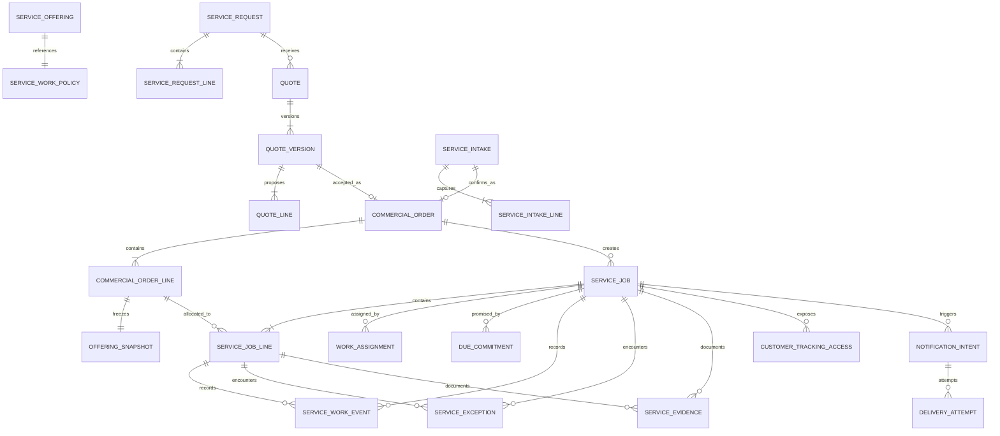

# Generic Service Catalog And Work Operations

Label: `implemented`

Status: source-complete-pending-behavioral-validation

## Problem Statement

EwaTrade's current Service feature was generalized from an early dry-cleaning
prototype, but its structure still assumes that every Service is immediate or
tracked, every Service Order creates one Job, every Order line belongs to one
Job Line, and status, assignment, due time, evidence, and notifications apply
to the whole Job. Public Requests snapshot prices before merchant review and
convert directly to sales. Evidence is a URL, Service work is online-only, and
broad Retail Ops permissions control operational actions.

Those assumptions cannot accurately support a generic Service business. A
merchant may charge for a Service without tracking work, split one ordered
quantity across work packages, prepare some lines before others, request or
quote work before an Order exists, begin unpaid work by policy, capture private
condition media offline, or publish only selected updates to a customer.
Payment, work, public access, and communication must remain separate facts.

The project is early-stage and current development Service data is disposable.
The prototype must be replaced cleanly rather than retained through legacy ids,
dual reads, metadata fallbacks, compatibility aliases, or old offline events.
Dry cleaning, repair, tailoring, salon work, installation, and consulting are
acceptance examples only; none may become a runtime industry type.

## Solution

Use the shared Catalog and Commerce model from the Generic Catalog, Offerings,
Inventory Units, And Stock Operations specification. Catalog owns concrete
Service Offerings. Commerce owns versioned Quotes, Commercial Orders, immutable
Offering Snapshots, and every monetary fact. Service Operations begins at
Intake and owns work authorization, Jobs, exact Job Line allocations, progress,
assignments, due commitments, evidence, exceptions, rework, and audit events.

A Service Offering declares whether it is charge-only or tracked and how work
becomes authorized. The shortest direct Intake selects an Offering and positive
quantity, reviews the immutable commercial meaning, and confirms. Customer,
requested time, promised time, instructions, condition, evidence, priority, and
assignment remain optional. Confirmation atomically creates the Commercial
Order and tracked work records; charge-only lines create no Job.

Public Service Requests record intent only. Staff may request clarification,
decline, or issue a versioned Quote. Acceptance idempotently creates the Order
and tracked work. Customer tracking uses scoped public access and exposes only
allowlisted milestones, promises, messages, evidence explicitly published for
that customer, and permitted payment actions.

Replace the schema, APIs, permissions, dashboard, mobile persistence and sync,
public routes, reports, notifications, tests, fixtures, and active
documentation in a destructive coordinated cutover. Authenticated registration
and operations remain on the shared application host; business subdomains are
reserved for future public storefronts.

## User Stories

1. As a business owner, I want a Service Offering to be either charge-only or
   tracked, so that charging never creates unnecessary work records.
2. As a business owner, I want each option combination to resolve to a stable
   Service Offering, so that prices and work refer to an exact customer choice.
3. As a business owner, I want whole Service quantities by default and optional
   decimal precision, so that pieces, hours, area, and distance are supported.
4. As a business owner, I want work authorization to follow Order confirmation,
   required payment, or manual release, so that unpaid work follows policy.
5. As a staff member, I want to start Intake with only an Offering and quantity,
   so that ordinary walk-in work is fast.
6. As a staff member, I want to select several Offerings and quantities in one
   Intake, so that a customer's work stays together.
7. As a staff member, I want anonymous walk-in Intake, so that customer creation
   is not mandatory.
8. As a staff member, I want to find or create a Customer during Intake, so that
   tracking and communication can be enabled when needed.
9. As a staff member, I want requested time and merchant promise kept separate,
   so that a request is not silently presented as a commitment.
10. As a staff member, I want instructions and condition to be optional, so that
    simple Intake is not slowed down.
11. As a staff member, I want to capture photos or videos optionally, so that
    handover condition can be documented.
12. As a staff member, I want to review Offering snapshots, quantities, prices,
    and totals before confirmation, so that mistakes are caught.
13. As a staff member, I want confirmation to create Order and work atomically,
    so that commercial and operational records cannot drift.
14. As a cashier, I want Product and Service lines in one Commercial Order, so
    that mixed purchases need one checkout.
15. As a manager, I want charge-only Service lines excluded from work queues, so
    that queues contain real operational work only.
16. As a manager, I want one Job to be the simple default while allowing explicit
    splits, so that common work is easy and exceptional work is representable.
17. As a manager, I want one ordered quantity allocatable across multiple Job
    Lines, so that split work remains quantity-safe.
18. As a worker, I want Job Lines to carry progress, so that some lines may be
    ready before others.
19. As a worker, I want queued, in-progress, blocked, ready-for-handoff,
    completed, and cancelled states, so that generic work is understandable.
20. As a manager, I want the Job summary derived from its lines, so that partial
    readiness is truthful.
21. As a worker, I want blockers and failed attempts recorded explicitly, so
    that problems are not hidden in notes.
22. As a manager, I want completed history immutable, so that later rework does
    not rewrite what occurred.
23. As a manager, I want rework linked to the original work, so that quality and
    repeat effort are measurable.
24. As a worker, I want pickup, delivery, and remote handoff recorded as events,
    so that different Service businesses use the same lifecycle.
25. As a manager, I want one optional primary assignee, so that responsibility
    is visible without building workforce scheduling.
26. As a manager, I want assignment history, so that reassignment is auditable.
27. As a manager, I want normal and urgent priority, so that queues can surface
    important work without changing commercial prices.
28. As a manager, I want a Due Commitment and overdue projection, so that
    promised work can be managed.
29. As a manager, I want rescheduling to require a reason, so that changed
    promises remain accountable.
30. As a worker, I want Offering Guidance, Intake Instructions, Internal Work
    Notes, and Customer Messages kept distinct, so that audiences are clear.
31. As a worker, I want evidence attached to a Job or Job Line, so that media has
    the correct operational context.
32. As a worker, I want evidence purpose and capture/upload history, so that the
    record explains what the media proves.
33. As a customer, I want my private condition media protected, so that internal
    evidence is never published accidentally.
34. As an authorized worker, I want to publish selected evidence explicitly, so
    that customers can see approved proof.
35. As an offline worker, I want media capture to queue and retry, so that poor
    connectivity does not block Intake.
36. As an auditor, I want evidence revocation to leave a tombstone, so that used
    operational history does not disappear silently.
37. As a customer, I want to submit a Service Request without placing an Order,
    so that the merchant can review uncertain work.
38. As a merchant, I want to request clarification or decline a Request, so that
    unsuitable intent does not become a sale.
39. As a merchant, I want a versioned Quote with expiry, so that revised prices
    never rewrite an issued proposal.
40. As a customer, I want to accept only the current Quote version, so that I
    know exactly what I approved.
41. As a customer, I want deposits and balances on my Commercial Order, so that
    work tracking does not become a payment ledger.
42. As a customer, I want a safe tracking link, so that I can follow progress
    without seeing internal records.
43. As a business owner, I want public request and tracking on my storefront, so
    that my authenticated dashboard is never exposed by business subdomain.
44. As an administrator, I want Service-specific capabilities, so that broad POS
    access does not grant every Service operation.
45. As an offline worker, I want Intake and work commands replayed idempotently,
    so that reconnecting cannot duplicate work.
46. As an offline worker, I want stale transitions surfaced for review, so that
    newer work is never silently overwritten.
47. As a manager, I want Service reports based on immutable events and snapshots,
    so that operational history remains trustworthy.
48. As a finance user, I want Service revenue read from Commerce, so that mutable
    work state never determines money.
49. As a customer-service worker, I want notification intent separate from
    delivery attempts, so that failed providers do not duplicate intent.
50. As a developer, I want the prototype deleted rather than adapted, so that
    there is one coherent Service domain.
51. As a developer, I want neutral cross-industry acceptance scenarios, so that
    an example never becomes runtime behavior.
52. As a platform owner, I want incompatible old clients and local events
    rejected/reset, so that removed semantics cannot re-enter the system.

## Implementation Decisions

### 1. Context ownership

- Catalog owns Catalog Item Service classification, Sellable Variant, Service
  Offering, Offering Pricing Policy, and Store Offering Availability.
- Commerce owns Quote/Quote Version, Commercial Order/Line, Offering Snapshot,
  discounts, taxes, deposits, receipts, payment state, cancellation, and refund.
- Service Operations owns Service Work Policy, Work Authorization, Service
  Intake, Service Job, Service Job Line, allocation, assignment, Due Commitment,
  Service Evidence, Service Work Event, exception, and rework.
- Customer Access owns Request Form configuration, Service Request access,
  Customer Tracking Access, and safe public projections.
- Communications owns Notification Intent, rendered Customer Message, manual
  sharing record, and provider Delivery Attempt.
- Reporting owns tenant-scoped projections only. It never becomes an
  independent source of commercial or work truth.
- Services never own Inventory Units, balances, reservations, transformations,
  custody, reorder state, or closeout stock lines.

### 2. Relational model

- One Order has zero to many Service Jobs.
- One tracked Order line has zero to many Service Job Line allocations.
- Active allocated quantity must be positive and must not exceed the ordered
  quantity after exact-decimal summation.
- Job Lines snapshot the source Order line and Offering meaning needed for work
  display without duplicating commercial price authority.
- Requests and Quotes retain immutable line snapshots appropriate to their
  commitment level; only an accepted Quote Version links to the created Order.
- Evidence stores asset references and metadata, never binary file contents.
- Public tokens are stored as secure digests; raw tokens are returned only at
  creation/rotation boundaries.

### 3. Service Offering and work policy

- Work Policy is exactly `CHARGE_ONLY` or `TRACKED`.
- Work Authorization Policy is exactly `ON_ORDER_CONFIRMATION`,
  `AFTER_REQUIRED_PAYMENT`, or `MANUAL_RELEASE`.
- A charge-only line never creates a Job Line regardless of payment state.
- A tracked line creates an allocation at confirmation. Progress beyond queued
  is forbidden until its Work Authorization is authorized.
- Payment requirements are read from Commerce. Service Operations records only
  the resulting authorization fact and source, not a second balance.
- Service quantities cross API, persistence, and offline boundaries as exact
  decimal strings, with configurable scale up to six and zero as the default.
- Offering option values are display snapshots. Runtime work logic never
  branches on garment, repair type, salon treatment, or another option name.

### 4. Intake and confirmation

- Service Intake status is `DRAFT`, `CONFIRMED`, or `CANCELLED`.
- Draft is editable and creates neither an Order nor work.
- Minimum Draft line is an active Store-available Service Offering plus a valid
  positive quantity.
- Customer, requested time, promised time, instructions, condition, evidence,
  priority, and assignee are optional.
- Requested time is customer input. Due Commitment is a merchant promise and
  must not be inferred silently from requested time.
- Confirmation revalidates Offering availability, pricing/approved Quote,
  quantity precision, membership/capability, Store, Customer access, and
  idempotency identity.
- Confirmation atomically creates the Commercial Order, immutable Offering
  Snapshots, one default Job for compatible tracked lines, exact allocations,
  initial Work Events, Due Commitment, and optional assignment.
- Confirmation retry returns the same result. A mismatched payload using the
  same idempotency key is an error.
- Confirmed Intake is immutable except for audit-safe references; corrections
  occur through Commerce and Service work operations.

### 5. Job grouping, progress, and rework

- Default grouping is one Job for compatible tracked lines from one confirmed
  Intake/Order in one Store.
- Split is explicit and moves uncompleted allocation quantity transactionally
  to a new Job. Quantity cannot be lost or duplicated.
- Automatic industry grouping and merge-after-work-start are forbidden.
- Job Line statuses and allowed transitions are:

| From | Allowed next states |
| --- | --- |
| `QUEUED` | `IN_PROGRESS`, `BLOCKED`, `READY_FOR_HANDOFF`, `COMPLETED`, `CANCELLED` |
| `IN_PROGRESS` | `BLOCKED`, `READY_FOR_HANDOFF`, `COMPLETED`, `CANCELLED` |
| `BLOCKED` | `QUEUED`, `IN_PROGRESS`, `CANCELLED` |
| `READY_FOR_HANDOFF` | `IN_PROGRESS`, `COMPLETED`, `CANCELLED` |
| `COMPLETED` | none |
| `CANCELLED` | none |

- Every transition carries expected revision, actor, effective time, recorded
  time, source, and optional reason.
- Job summary is derived from active and terminal lines. It may display queued,
  in progress, blocked, partially ready, ready for handoff, completed, or
  cancelled without becoming a second independently edited state machine.
- Delay, quality exception, failed attempt, customer rejection, pickup,
  delivery, remote handoff, and other operational facts are typed events or
  exception outcomes.
- Before completion, rework may return a ready line to in progress with a
  reasoned rework event. After completion, rework creates a new linked cycle or
  allocation; completed history is immutable.
- Commercial line cancellation/refund is separate. Operational cancellation
  records stopped work and linkage but does not issue money automatically.

### 6. Assignment, priority, and Due Commitment

- V1 has one current optional primary Job assignee plus immutable assignment
  history. Line assignments and multi-worker teams are not modeled.
- Assignee must be an active member of the Business with Store access and the
  required Service capability.
- Self-assignment offline is allowed only when the cached capability grant and
  Store membership are valid; server replay remains authoritative.
- Priority is `NORMAL` or `URGENT`; it affects queue ordering only.
- One current optional Job-level Due Commitment is inherited by its lines.
- Work with different promises must be explicitly split.
- Rescheduling creates a replacement Due Commitment/history entry with reason,
  actor, old promise, new promise, and timestamps.
- Due today/overdue is derived from current promise, Business/Store timezone,
  and incomplete active lines. Payment state never affects due calculation.

### 7. Instructions, evidence, privacy, and messages

- Offering Guidance is catalog content; Intake Instructions are supplied at
  handover; Internal Work Notes are staff-only operational text; Customer
  Messages are explicitly customer-facing content.
- Service Evidence purpose is one of intake condition, progress, completion,
  exception, approval, or handoff, with an extensible neutral `OTHER` purpose.
- Evidence visibility is private by default. Publication requires a dedicated
  capability, available asset, customer tracking scope, and explicit action.
- Upload lifecycle is local, queued, uploading, available, failed, or revoked.
- Pending/failed evidence never blocks Intake confirmation or unrelated work.
- Publication is forbidden until the asset is available and safety metadata is
  valid. A private/revoked asset never appears in the public projection.
- Revocation leaves an audited tombstone. Access and publication events are
  auditable without placing evidence contents in ordinary reports.
- Public responses never expose storage keys, internal notes, staff identity,
  private contact data, tenant existence, or raw internal ids.

### 8. Request, Quote, approval, and tracking

- Service Request status is submitted, needs information, quoted, declined,
  withdrawn, or converted. It owns intent, not a price promise.
- Request Forms are scoped to a Store, an allowed Offering set, active period,
  and optional expiry. Disabled/expired forms reject new submissions without
  deleting history.
- Quote status is draft, issued, accepted, declined, expired, or superseded.
- Editing an issued Quote creates a new version and supersedes the previous
  current version. Issued versions are immutable.
- Quote acceptance validates token, expiry, current version, Offering
  availability, exact quantities, price snapshots, and idempotency.
- Acceptance creates one Order once; repeat acceptance returns it. Conflicting
  acceptance is typed and does not create another Order.
- Deposits, balances, payment links, and refunds remain Commerce actions.
- Customer Tracking Access is scoped to one Job/customer purpose and supports
  rotation, revocation, expiry where configured, and rate limiting.
- Customer milestones are allowlisted projections, not direct serialization of
  internal status enums.
- Storefront owns Request, Quote approval, and tracking routes. Marketing may
  link to the storefront but must not duplicate route implementation.

### 9. API, capabilities, and conflicts

- Use explicit Catalog, Commerce, Service Operations, Customer Access,
  Communications, and Reporting API families.
- Mutations accept command id, client/device id where applicable, expected
  revision, effective time, Store scope, and the smallest domain payload.
- Stable error families include not found within scope, capability denied,
  invalid Offering kind/policy, inactive Offering, price/Quote conflict,
  quantity precision/allocation conflict, work not authorized, invalid
  transition, stale revision, terminal work, invalid assignee, due conflict,
  evidence unavailable/private/revoked, token invalid/expired/revoked,
  idempotency mismatch, and unsupported client/event version.
- Capabilities include Service Intake create/confirm, work view/update, work
  assign, due manage, evidence capture/manage, evidence publish, Request manage,
  Quote manage, customer access manage, notification manage, and report view.
- Roles grant capabilities but every command rechecks active membership,
  Business, Store, resource ownership, and capability.
- Public lookup is fail-closed and must not reveal cross-tenant existence.

### 10. Offline behavior

- Offline v1 supports Draft Intake, Intake confirmation commands, Job/Line
  status events, Internal Work Notes, assignment to self, and evidence capture.
- Public Requests, Quote issue/acceptance, payment, evidence publication,
  customer communication dispatch, and public-token management require online
  authority.
- Local records and commands use stable client ids, schema/event versions,
  dependency ids, exact decimal strings, expected server revision, and
  provisional status.
- Intake confirmation depends on synchronized Offering/price/Store/capability
  snapshots. Evidence upload depends on confirmed Job/Line identity; evidence
  publication depends on successful upload.
- Server replay is idempotent and may accept, reject, or return a typed conflict.
  It never silently coerces status, quantity, assignee, promise, evidence, or
  permissions.
- Conflict review shows attempted action, authoritative state, reason, safe
  retry/discard guidance, and related dependent commands.
- The clean cutover bumps/resets local Service storage and discards old queued
  events; there is no old-event reader.

### 11. Experience decisions

- Service Setup consumes the sibling Catalog specification: simple Service
  creates a default variant and fixed Offering; advanced setup uses merchant
  option combinations and fixed or quote-required pricing. No inventory fields
  appear.
- Intake shortest path is select Offering/quantity, review, confirm. Optional
  sections progressively reveal Customer, timing, instructions/condition,
  evidence, priority, and assignment.
- Work Queue supports search/filter, due/overdue, priority, assignee, progress,
  offline/provisional state, empty/loading/error/conflict states, and clear
  access to Job Workspace.
- Job Workspace shows commercial reference/payment summary without editing
  payment, line progress and partial readiness, assignment, promise history,
  notes, evidence, exceptions/rework, messages, and audit timeline.
- Requests/Quotes, Customer Tracking, and Reports are distinct workflows rather
  than tabs in one oversized Job page.
- Dashboard implementation follows the repository Midday architecture for
  routes, URL state, tables, sheets, forms, mutations, loading/error/empty
  states, and browser QA.
- Mobile uses the established authenticated full-screen workflow, keyboard-safe
  forms, durable local store, sync-status/conflict patterns, and device media
  capture.
- Dry-cleaning data proves the garment/size matrix and multi-item Intake. Repair
  or consulting data proves that no garment or physical-handoff assumption is
  required.

### 12. Reporting, notifications, and audit

- Commerce reports are authoritative for gross/net Service revenue, discounts,
  refunds, paid amounts, and outstanding balance using immutable Order data.
- Service reports derive WIP, queue age, cycle time, due/overdue, on-time rate,
  blocked time, readiness, throughput, cancellation, exception, rework, and
  assignment workload from line allocations and timestamped events.
- Request/Quote reporting derives submission, clarification, issue, acceptance,
  decline, expiry, and conversion funnels from their own histories.
- Current mutable Catalog names or prices never rewrite historical dimensions.
- Evidence contents are excluded from reports. Audit views expose only scoped
  metadata and access/publication/revocation events.
- Notification Intent is deduplicated by business event/audience/template
  purpose. Rendered Message and each manual/provider Delivery Attempt retain
  their own status and timestamps.
- Provider failure permits a retry attempt or manual fallback without creating
  another intent.

### 13. Clean replacement and implementation order

- Delete the prototype Service profile, fulfillment enum, singular Job
  relations, current Job/Request/notification enums, URL evidence contract,
  legacy ids and migration reader, direct Request conversion, broad Retail Ops
  authorization, duplicate public routes, metadata fallbacks, old offline
  assumptions/events, industry fixtures, and tests that assert rejected shapes.
- Do not add backfill, compatibility mapping, alias, redirect/token reader,
  dual-write, or preservation migration for development Service records.
- Recommended implementation order:
  1. Shared exact quantity and resolved sibling Catalog/Commerce foundations.
  2. Clean Service domain schema, invariants, capabilities, and command layer.
  3. Direct Intake through Order and tracked Job as the first vertical proof.
  4. Job Line progress, split, assignment, due, exceptions, and rework.
  5. Managed evidence and offline capture/replay/conflict review.
  6. Public Request, Quote, acceptance, tracking, and publication.
  7. Notifications, reports, audit, dashboard, and mobile completion.
  8. Destructive database/client reset, neutral seeds, deletion gates, Brain
     updates, and full cross-surface QA.
- Prisma schema changes follow the repository migration command plus all
  required local, production, and attempted remote push profiles. Migration
  files are generated by repository commands, never handcrafted.

## Testing Decisions

### Test philosophy and seams

- Test observable domain behavior and privacy boundaries, not repository helper
  implementation details.
- Primary end-to-end seam: select concrete Service Offerings, confirm direct
  Intake or accept a Quote, create one Commercial Order, create only tracked
  work, progress Job Lines, and project safe customer tracking.
- Database/service seam verifies constraints, exact allocation, atomicity,
  idempotency, revision conflicts, tenant isolation, and immutable history.
- Typed API seam verifies validation, capabilities, stable errors, public token
  safety, and online/offline command boundaries.
- Dashboard, mobile, and storefront seams verify the shortest path, rich path,
  accessibility, offline/provisional states, and public privacy.
- Source/deletion seam proves rejected runtime names, models, fallbacks,
  compatibility readers, duplicate routes, and old event versions are absent.

### Required invariant tests

- Charge-only lines create no Job or allocation.
- Services create no inventory relation, reservation, movement, balance, or
  custody effect.
- Active allocations never exceed exact ordered quantity.
- Work cannot progress before authorization.
- Job summary matches its Job Lines, including partial readiness.
- Completed/cancelled allocations are terminal; post-completion rework is linked.
- Commercial cancellation/refund never silently rewrites work and vice versa.
- Only current valid Quote Version acceptance creates one Order idempotently.
- Private, unavailable, failed, or revoked evidence never appears publicly.
- Every mutation enforces Business/Store ownership and capability.
- Offline replay cannot duplicate Intake, Order, Job, event, assignment, or
  evidence; stale actions return visible typed conflicts.

### Required acceptance scenarios

1. **Simple charge-only Service**: configure, sell with a mixed Product line,
   confirm one Order, and prove no Service Job or inventory effect for Service.
2. **Dry-cleaning Intake**: select Agbada/Small, Shirt/Large, and Trouser/Small
   quantities with optional promise/media; verify snapshots, total, one default
   Job, and no industry runtime branch.
3. **Partial readiness**: advance one Job Line to ready while another is in
   progress; verify derived partial state and safe tracking milestone.
4. **Split work**: move an exact subset of an ordered quantity to a second Job;
   prove allocation conservation and independent due/assignment.
5. **Authorization**: exercise confirmation, payment-required, and manual
   release without treating payment state as work state.
6. **Cancellation/rework**: cancel unfinished allocation independently from
   refund; create linked rework after completion without reopening history.
7. **Evidence privacy**: capture offline, retry upload, publish one asset,
   revoke it, and prove all other evidence/internal data stays private.
8. **Public Request/Quote**: submit intent, request clarification, issue/revise
   Quote, reject stale acceptance, accept current version once, and track work.
9. **Non-physical Service**: use consulting or remote repair diagnosis to prove
   pickup/delivery and customer-supplied physical items are optional.
10. **Offline conflict**: replay duplicate confirmation, stale transition,
    changed assignment capability, revised promise, and dependent evidence.
11. **Tenant isolation**: attempt cross-Business/Store access through internal
    commands and every public token path.
12. **Clean cutover**: verify reset behavior and repository searches for all
    removed models, enums, ids, metadata fallbacks, route duplication, and
    industry-specific runtime branches.

### Completion gates

- Domain, property, repository, API contract, dashboard, mobile, storefront,
  offline replay/conflict, privacy/security, and deletion suites pass.
- Typecheck, formatting/lint, generated-client validation, and relevant package
  tests pass.
- Required Prisma migration/push profiles are attempted and reported.
- Neutral seeds and both physical/non-physical Service acceptance data pass.
- Brain schema, relationships, migrations, API endpoints/contracts/permissions,
  feature, ADR, task, and glossary documents match the implemented model.
- No unresolved compatibility adapter, old client/event reader, or private-data
  exposure remains.

## Out of Scope

- Product Inventory Units, Product stock accounting, stock transformations, or
  Product fulfillment; the sibling specification owns them.
- Recurring Services, subscriptions as Service recurrence, appointments,
  calendars, time slots, waitlists, route scheduling, resource/equipment
  capacity, worker capacity, teams, line assignment, or automatic scheduling.
- Arbitrary merchant-authored workflow or status builders.
- Automatic consumable Product deduction, bill of materials, or job costing.
- Payroll, commissions, attendance, timesheets, or HR management.
- Provider-native payment, SMS, WhatsApp, email, calendar, object-storage, or
  transcoding integrations. Adapter boundaries may exist; provider delivery is
  not required.
- Signatures, legal consent frameworks, configurable evidence retention periods,
  or regulated-industry compliance workflows beyond private-by-default safety.
- Public fixed-price direct checkout without the approved Request/Quote or
  staff Intake confirmation flow.
- Legacy data migration, link preservation, compatibility aliases, dual writes,
  or old offline-event interpretation.
- Industry-specific runtime schemas, namespaces, permissions, navigation, or
  reports.

## Further Notes

- The Generic Catalog, Offerings, Inventory Units, And Stock Operations
  specification is a required sibling. This specification consumes its Catalog
  Item, Sellable Variant, Service Offering, Offering Pricing Policy, Store
  Offering Availability, Commercial Order, and Offering Snapshot contracts and
  must not duplicate or weaken them.
- Zero is a real free fixed price. Unknown/negotiated price uses quote-required
  pricing and cannot be represented as a zero placeholder.
- The simple dry-cleaning flow is fully covered: create Service Offerings,
  select several items, optionally set a promise and capture photos/videos,
  review, confirm, and progress work. The same model must pass a non-cleaning
  scenario before implementation is accepted.
- Registration and authenticated dashboards never use the business storefront
  subdomain. Storefront publication remains a separate future/public concern.
- This is a clean replacement. When implementation begins, destructive database
  and client resets must be coordinated and reported, but no legacy records are
  preserved.
